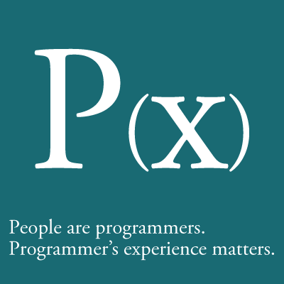

ブログを始める準備をしています。考えたこと、やったことを一覧にしておきます。

## タイトル決めとロゴデザイン

はてなダイアリーでいろいろ書いていたやっていた頃よりも研究・開発にフォーカスしたブログにしようと思っています。狙いが明確だったので、タイトル決めやデザインも楽でした。

まず、僕の研究上の大目標は、国民皆プログラマ化です。それは別に、プログラミングを啓蒙したいということではありません。みんな普段からけっこうプログラミングのキモになる概念を使って暮らしている(People are programmers.)という考え方がベースにあって、その暮らしと、本気のプログラミングを使ってもっと便利に楽しくなった暮らしの間のギャップを埋める、実世界指向のエンドユーザプログラミングを可能にしたいと思っているのです。

この大目標に取り組む以前の問題として、僕は今あるプログラミング言語・ライブラリ・開発環境に著しい不足を感じています。User experience (UX)という言葉が流行っている昨今、プログラマのプログラミング体験(Programmer's experience, PX)は何年も前から大して向上しているように思えません。言語・ライブラリ・開発環境、それぞれの面で少しずつ改善はしているのですが、ある目的のプログラムを作ろうとしたときのワークフロー全体を支援してくれる、流れるようなプログラミング体験を実現してくれる環境はあまりないのです。PXの視点の欠如は、[Programmers are people, too.](http://queue.acm.org/detail.cfm?id=1071731 "Programmers Are People, too - ACM Queue")とか[Software engineers are people, too.](http://www.cs.cmu.edu/~natprog/papers/Myers2012ICSE_Talk.pdf "Software Engineers are People Too: Applying Human Centered Approaches to Improve Software Development. - Brad Myer's talk slides")といった言葉が端的に表しています。プログラマは、人のために便利な道具を作るくせに、自分たちのことを人だと思っていないのではないでしょうか。

そこで、Programmer's experience (PX)をロゴの中心に据えて、下に補足する文を足しました。タイポグラフィだけのロゴにしたのは、自分が言葉（文字言語）が好きだから、あと非常にミーハーですがWindows 8 UIに影響されたからです:)

## WordPressのインストール

タイトルとかロゴといった一番楽しいところを考え終えたら、あとはブログシステムのインストールです。昔は[ミドルウェアの一部として自作](http://digitalmuseum.jp/software/chippie/ "Chippie : digitalmuseum")していたのですが、最近は出来合いのシステムを作ったほうがいろいろ便利です…。

- [WordPress 3.4.2 日本語版](http://ja.wordpress.org/)のサーバへのダウンロードと展開
- ./config.sample.phpを編集してconfig.phpにコピー
- ブログのURLにアクセスしてデータベース初期化
- パーマリンク設定をカスタマイズして個々のブログ記事のURLを/月/日/slug/形式に変更

## 外観テーマとプラグインのインストール

### WP-Bootstrap

[主サイト](http://junkato.jp/)のデザインをBootstrapベースで書いているので、これに合わせるため、WordPress用のBootstrapベースのデザインのテーマをインストールしました。

- [WP-Bootstrap](http://320press.com/wpbs/)のサーバへのダウンロードと./wp-contents/themes/への展開
- [wordpress-bootstrap/library/css/bootstrap.css](http://junkato.jp/ja/blog/wp-content/themes/wordpress-bootstrap/library/css/bootstrap.css)などのURLで参照されているBootstrapを主サイトのものに差し換え
- functions.php, header.php, style.css, footer.phpを編集してデザインのバグを修正
- [wordpress-bootstrap/library/images/icons/h/apple-touch-icon.png](http://junkato.jp/ja/blog/wp-content/themes/wordpress-bootstrap/library/images/icons/h/apple-touch-icon.png)などのURLで参照されているブログサイトのアイコンを自作のものに差し換え

### WP Social Bookmarking Light

イマドキのサイトらしく記事ごとにTwitterやFacebookのボタンをつけておきたくて、それができるプラグインをインストールしました。

- [WP Social Bookmarking Light](http://www.ninxit.com/blog/2010/06/13/wp-social-bookmarking-light/)のサーバへのダウンロードと./wp-contents/plugins/への展開
- プラグインの有効化
- はてなブックマーク、Facebook、Twitterのボタンを、この順番で並べるように設定

### WP-OGP Customized

Facebookのボタンをつけたところで、そういえばFacebookはOpen Graph protocolとかいう書式を使ってWebサイトのメタ情報を見てるんだった、と思いだしたので、それをWordPressのヘッダに書き加えるプラグインをインストールしました。

- [WP-OGP Customized](http://inspire-tech.jp/2011/07/wp_ogp_customized_plugin/)のサーバへのダウンロードと./wp-contents/plugins/への展開
- og:imgのデフォルト画像を更新
- プラグインの有効化
