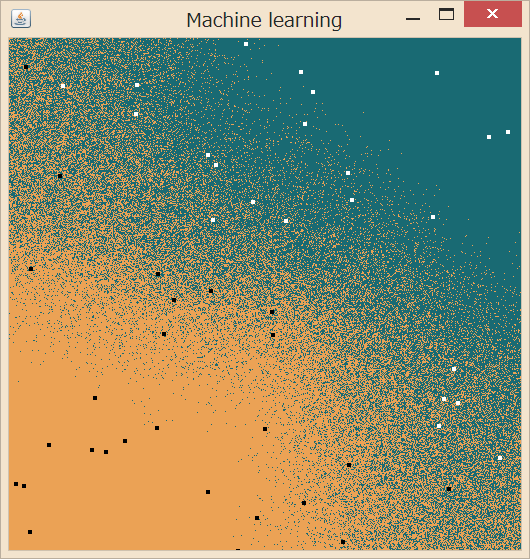
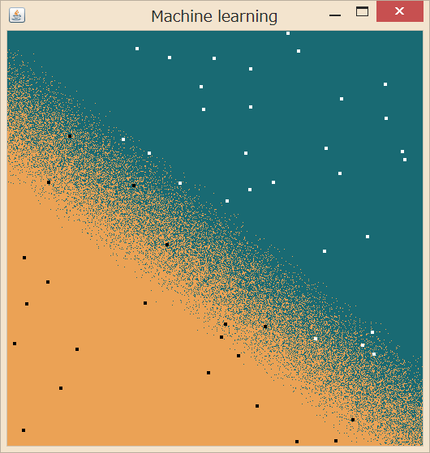
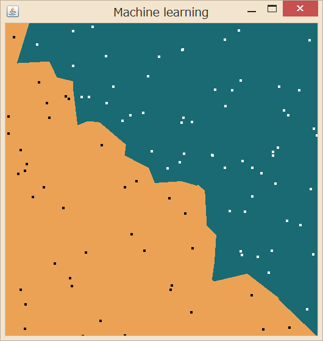
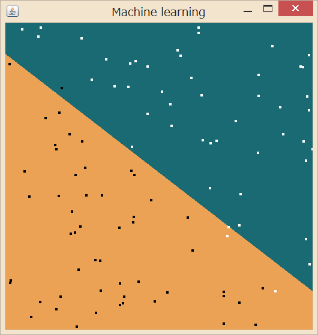

OpenCVには機械学習の実装がいくつか（[単純ベイズ、k近傍、SVM、決定木…](http://opencv.jp/opencv-2svn/cpp/ml_statistical_models.html)）用意されていて、画像処理に限らず汎用目的で便利に使うことができます。実装ごとにクラス化されていて、学習(train)→予想(predict)という似たようなメソッドが用意されているため、学習結果がイマイチなら他に切り替える、ということも比較的簡単にできるようです。

この便利な機能は、Java版ラッパーであるJavaCVにもポーティングされています。そこで、とりあえず5次元ベクトル群を2つのクラスに分類するコードを書いてみました。下の画像では、5次元中2次元を可視化しています。他のパラメタで実行してみた画面キャプチャやコード全体は記事末尾にあります。JavaCVのインストールなどに関しては前の記事「[OpenCVをJavaから使う](http://junkato.jp/ja/blog/2012/11/04/use-opencv-from-java/)」をどうぞ。

## 準備

\[java\] // Parameters for the test int numBins = 5; int numSamples = 50; int visualizationSize = 512;\[/java\]

numBinsで次元、numSamplesで学習に使うサンプルの数を決めます。visualizationSizeは画面に表示するウィンドウの大きさです。

\[java\] // Initialize the classifier. opencv\_ml.CvKNearest classifier = new opencv\_ml.CvKNearest(); int k = 1;\[/java\]

まずは、k-Nearest Neighbor法を使ってみることにします。

## 学習させる

\[java\] // Initialize the training set. opencv\_core.CvMat trainingDataMat = CvMat.create( numSamples, numBins, opencv\_core.CV\_32FC1); opencv\_core.CvMat labelsMat = CvMat.create( numSamples, 1, opencv\_core.CV\_32FC1);\[/java\]

行列trainingDataMatにサンプルを、labelsMatにサンプルの分類を表す値を入れていきます。

\[java\] double\[\] values = new double\[numBins\]; for (int i = 0; i < numSamples; i ++) { createTrainingData(values);

// Be cautious, this shouldn't be put(i, values)!! trainingDataMat.put(i\*numBins, values);

float category = categorize(values); labelsMat.put(i, category); }\[/java\]

createTrainingData(double\[\] values)はランダムなサンプルの値を生成するメソッド、categorize(double\[\] values)は与えられたサンプルの分類(ground truth)を与えるメソッドです。

注意すべき点として、CvMat型のputメソッドは第一引数に行列中で値を代入したい場所のインデックスを与えるのですが、例えば5行10列の行列に10列の配列データを代入するとして、3行目に代入したいならput(2, data)ではいけません。put(2 \* 5, data)です。行列とはいっても中では普通の一次元配列として持っているようで、インデックスにはその一次元配列中での位置を指定しないといけないんですね。これで半日はまりました。

\[java\] // Train the classifier. try { classifier.train(trainingDataMat, labelsMat, null, false, k, false); } catch (Exception e) { return; }\[/java\]

[CvKNearest::train](http://opencv.jp/opencv-2svn/cpp/ml_k_nearest_neighbors.html#cvknearest-train)に書いてあるように引数を与えて、学習を行います。

## 新しいサンプルを分類する

\[java\] // Predict and visualize the results for the test set. opencv\_core.CvMat predictionMat = CvMat.create( 1, numBins, opencv\_core.CV\_32FC1); // 中略 createTrainingData(values); // 中略 predictionMat.put(0, values); // 中略 float label = classifier.find\_nearest( predictionMat, k, null, null, null, null);\[/java\]

学習後は、新しいサンプルに対して[CvKNearest::find\_nearest](http://opencv.jp/opencv-2svn/cpp/ml_k_nearest_neighbors.html#cvknearest-find-nearest)を呼んで、既存のサンプルのなかで近いものk個の多数決で分類の予想値を取得できます。

## 他のアルゴリズムも試す

一種類できれば他のアルゴリズムに差し換えるのも簡単です。

\[java\] // Initialize the classifier. opencv\_ml.CvSVM classifier = new opencv\_ml.CvSVM(); opencv\_ml.CvSVMParams params = new opencv\_ml.CvSVMParams(); params.svm\_type(opencv\_ml.CvSVM.C\_SVC); params.kernel\_type(opencv\_ml.CvSVM.LINEAR); params.term\_crit(opencv\_core.cvTermCriteria( opencv\_core.CV\_TERMCRIT\_ITER, 1000, 0.001)); //（中略） classifier.train(trainingDataMat, labelsMat, null, null, params); //（中略） opencv\_core.CvMat resultMat = CvMat.create( visualizationSize \* visualizationSize, 1, opencv\_core.CV\_32FC1); float result = classifier.predict(predictionMat, resultMat); //（中略） float label = (float) resultMat.get(x + y \* visualizationSize);\[/java\]

例えば、該当箇所をこのように書き換えればSVMでの機械学習ができます。k-Nearestよりも線引きがはっきりするアルゴリズムなので、実際、分布がはっきり分かれていますね。また、学習サンプルの個数があまり多くないので、線引きの傾きがground truthと比べるとときどきズレるのも確認できました。

## もっと試す

numBinsを2にして2次元のデータで試しました。こっちのほうがアルゴリズムの違いが分かりやすいですね！

最近傍のサンプルを参照してクラス分けを行うk-Nearest Neighbor法に…

ぱっくり線引きを行うSVM。

numSamplesを増やしていくと、計算時間の差が歴然です。k-Nearest Neighbor法は学習に全く時間がかからない代わりに分別にすごく時間がかかりますが、SVMは学習に少しだけ時間がかかるけど分別はすぐですね。

## ソースコード全文

\[java\]import java.awt.Color; import java.awt.Graphics2D; import java.awt.RenderingHints; import java.awt.event.MouseEvent; import java.awt.event.MouseAdapter; import java.awt.image.BufferedImage;

import javax.swing.SwingUtilities;

import com.googlecode.javacv.CanvasFrame; import com.googlecode.javacv.cpp.opencv\_core; import com.googlecode.javacv.cpp.opencv\_core.CvMat; import com.googlecode.javacv.cpp.opencv\_ml;

public class MachineLearningKNN { public static void main(String\[\] args) throws Exception { new MachineLearningKNN(); }

// Parameters for the test int numBins = 5; int numSamples = 50; int visualizationSize = 512;

CanvasFrame trainingFrame;

public MachineLearningKNN() { SwingUtilities.invokeLater(new Runnable() { public void run() { trainingFrame = new CanvasFrame("Machine learning"); trainingFrame.setDefaultCloseOperation(CanvasFrame.EXIT\_ON\_CLOSE); trainingFrame.getCanvas().addMouseListener(new MouseAdapter() { @Override public void mouseClicked(MouseEvent arg0) { update(); } }); update(); } }); }

private void update() {

// Prepare the window. BufferedImage image = new BufferedImage( visualizationSize, visualizationSize, BufferedImage.TYPE\_4BYTE\_ABGR); Graphics2D g2 = image.createGraphics(); g2.setRenderingHint( RenderingHints.KEY\_ANTIALIASING, RenderingHints.VALUE\_ANTIALIAS\_OFF); g2.setColor(Color.white); g2.fillRect(0, 0, image.getWidth(), image.getHeight()); g2.dispose(); trainingFrame.showImage(image);

// Initialize the classifier. opencv\_ml.CvKNearest classifier = new opencv\_ml.CvKNearest(); int k = 1;

// Initialize the training set. opencv\_core.CvMat trainingDataMat = CvMat.create( numSamples, numBins, opencv\_core.CV\_32FC1); opencv\_core.CvMat labelsMat = CvMat.create( numSamples, 1, opencv\_core.CV\_32FC1); double\[\] values = new double\[numBins\]; for (int i = 0; i < numSamples; i ++) { createTrainingData(values);

// Be cautious, this shouldn't be put(i, values)!! trainingDataMat.put(i\*numBins, values);

float category = categorize(values); labelsMat.put(i, category); }

// Train the classifier. try { classifier.train(trainingDataMat, labelsMat, null, false, k, false); } catch (Exception e) { return; }

// Predict and visualize the results for the test set. opencv\_core.CvMat predictionMat = CvMat.create( 1, numBins, opencv\_core.CV\_32FC1); Color green = new Color(25, 106, 115); Color orange = new Color(235, 162, 85); g2 = image.createGraphics(); for (int x = 0; x < visualizationSize; x ++) { int ymax = numBins > 1 ? visualizationSize : 1; for (int y = 0; y < ymax; y ++) { createTrainingData(values); values\[0\] = (double) x / visualizationSize; if (numBins > 1) { values\[1\] = (double) y / visualizationSize; } predictionMat.put(0, values);

float label = classifier.find\_nearest( predictionMat, k, null, null, null, null); g2.setColor(label == 1 ? green : orange);

int sy, ey; if (numBins > 1) { sy = ey = y; } else { sy = 0; ey = visualizationSize - 1; } g2.drawLine(x, sy, x, ey); } }

for (int i = 0; i < numSamples; i ++) { float label = (float) labelsMat.get(i); g2.setColor(label == 1 ? Color.white : Color.black); int x = (int) (trainingDataMat.get(i, 0) \* visualizationSize); int y; if (numBins > 1) { y = (int) (trainingDataMat.get(i, 1) \* visualizationSize); } else { y = visualizationSize / 2; } g2.fillOval(x, y, 5, 5); } g2.dispose(); trainingFrame.showImage(image); }

private void createTrainingData(double\[\] values) { for (int j = 0; j < numBins; j ++) values\[j\] = Math.random(); }

private float categorize(double\[\] params) { if (params.length == 1) return params\[0\] < 0.5 ? -1 : 1; return params\[0\] < params\[1\] ? -1 : 1; } }\[/java\]
