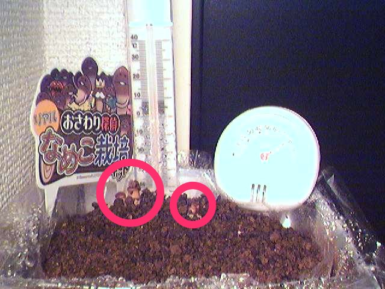

最近、照明をON/OFFする機能を備えたArduinoベースのネットワークカメラを開発したのですが、そこから定期的に画像を取ってきて保存したくなりました。自宅サーバとしてMac mini Mid 2010 (Mac OS X Snow Leopard)を使っているので、Mac miniで定期的にwgetを走らせることができればよいはずです。言ってしまえば簡単なことですが、意外と設定に手間取ったので手順を書いておきます。

## カメラの画像を日付連番で保存するスクリプト

まず、カメラから画像を取ってきて日付連番で保存するスクリプトを書きます。dateコマンドで現在の日付を適当なフォーマットに整形し、それをwgetの出力ファイル名として渡します。最新の画像はln -sでnewest.jpgからシンボリックリンクを張って常にアクセスできるようにしておきます。カメラから画像を取ってくるwgetの前後にアクセスしているURLは照明をON/OFFするためのものです。

\[bash\]#!/bin/bash

DIR=/Users/arc/Pictures/Visionsketch/Fungus/ DATE=\`date +"%Y-%m-%d-%H%M"\` /opt/local/bin/wget http://192.168.10.7/sendirsignl1 -O - sleep 5 /opt/local/bin/wget http://192.168.10.7/takepicture -O "${DIR}${DATE}.jpg" rm "${DIR}newest.jpg" ln -s "${DIR}${DATE}.jpg" "${DIR}newest.jpg" /opt/local/bin/wget http://192.168.10.7/sendirsignl0 -O -\[/bash\]

## スクリプトを定期的に実行するための設定ファイル

スクリプトを自分で実行してみて問題なければ、これを定期的に実行するための設定ファイルを書きます。Mac OS Xでは、定期的に実行したいジョブは特別なXML形式(plist)で設定ファイルを書いてlaunchctlに読み込ませ、launchdに実行させます。

\[xml\]<?xml version="1.0" encoding="UTF-8"?> <!DOCTYPE plist PUBLIC "-//Apple//DTD PLIST 1.0//EN" "http://www.apple.com/DTDs/PropertyList-1.0.dtd"> <plist version="1.0"> <dict> <key>Label</key> <string>jp.digitalmuseum.FungusCamera</string> <key>ProgramArguments</key> <array> <string>/Volumes/MyBook/Documents/Scripts/photo-fungus.sh</string> </array> <!-- <key>StartCalendarInterval</key> <dict> <key>Minute</key> <integer>0</integer> </dict> --> <key>StartInterval</key> <integer>3600</integer> <key>RunAtLoad</key> <true/> <key>ExitTimeout</key> <integer>300</integer> </dict> </plist>\[/xml\]

Labelには他と被らない適当な文字列を指定し、ProgramArgumentsに先ほど作成したシェルスクリプトのフルパスを指定します。このスクリプトが実行される際は、/opt/local/binにパスが通っていないため、前出のスクリプト内ではwgetをフルパスで指定していました。StartIntervalには実行間隔を秒単位で書きます。StartCalendarIntervalは、指定した時間(Hour)や分(Minute)に実行させたいとき、StartIntervalの代わりに指定します。ExitTimeoutで指定した時間内にジョブが終了しなければ、ジョブは強制的にkillされます。

## 設定の確認

ここまでの準備ができたら設定を読み込ませて正しく動作するか確認します。

\[bash\]launchctl load jp.digitalmuseum.FungusCamera.plist ps aux | grep fungusCamera.sh launchctl list -x jp.digitalmuseum.FungusCamera ls /Users/arc/Pictures/Visionsketch/Fungus/\[/bash\]

launchctl loadでplistを読み込ませ、定期的に実行するようにします。

なお、plistでRunAtLoadをtrueにしておくとload時にタスクが実行されます。これにより、本当にカメラから画像が読み込まれるかすぐに確認できます。launchtl loadしてから即座にps auxでプロセス一覧を表示すると、その中にfungusCamera.shを実行しているプロセスがあることが分かるはずです。

launchctlが読み込んだ内容はlaunchctl listで確認できます。-xオプションをつけるとXML形式で見ることができます。

最後に、lsで画像ファイルがちゃんと生成されているかも見ておきましょう。
