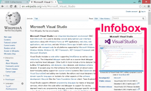

[前日](http://junkato.jp/ja/blog/2014/01/12/mediawiki/ "MediaWikiの多言語対応を調べた | junkato.jp")に引き続き[MediaWiki](http://www.mediawiki.org/wiki/MediaWiki "MediaWiki")に関する記事です。 

素のMediaWikiは、記事を全てWiki記法でべた書きしなくてはなりません。Wikipediaの記事では、右の図の情報ボックス([Infobox](http://ja.wikipedia.org/wiki/Template:Infobox "Template:Infobox - Wikipedia"))のように、記事の種類ごとに[テンプレート](http://ja.wikipedia.org/wiki/Help:%E3%83%86%E3%83%B3%E3%83%97%E3%83%AC%E3%83%BC%E3%83%88 "Help:テンプレート - Wikipedia")があって、同じようなレイアウトのWikiデータを何度もコピー＆ペーストしないで済むようになっています。

Wikipediaの便利なテンプレートを自分で設置したローカルのMediaWikiでも使えるようにするには、まずWikipediaでInfoboxを定義しているデータをXMLファイルとしてエクスポートしてから、ローカルのMediaWikiにインポートする必要があります(**Wikiデータのコピー**)。また、特定の拡張機能に依存しているテンプレートの場合は、当該の拡張機能もインストールする必要があります(**依存関係にある拡張機能のインストール**)。さらに、テンプレート内で独自の画像を埋め込んでいる場合は、画像ファイルも別途コピーしてくる必要があります(**画像データのコピー**)。Infoboxはこれら三つ全てに当てはまるケースで、非常に面倒でした。

そこで、WikipediaのテンプレートInfoboxを、さくらインターネットのサーバに設置したMediaWikiでも使えるようにした手順を説明します。先に言っておきますと、長いです。

## テンプレートのエクスポートとインポート

まず、Wikipedia閲覧中に、自分のMediaWikiでも使ってみたいよさそうなテンプレート(定型表現)を見かけたとします。Wikiのいいところは、その部分がどんなWiki記法で書かれているかすぐに調べられるところです。ページ右上の "Edit" をクリックして、該当箇所が **{{Infobox (中略)}}** と書かれていることが分かりました。これは、該当箇所がInfoboxテンプレートを用いて書かれていることを表しています。[Template:Infobox](http://en.wikipedia.org/wiki/Template:Infobox)にアクセスすると、Infoboxテンプレートについての詳しい説明を読むことができます。

さて、テンプレートの名前が分かったところで、そのデータをXMLファイルとしてエクスポートしましょう。そのためには、[Special:Export](https://en.wikipedia.org/wiki/Special:Export)にアクセスします。このExportページは、MediaWikiエンジンで動作しているどのWikiにも備わっています。大きなテキストエリアに **Template:Infobox** と入力して、 Include only the current revision, not the full history,  Include templates,  Save as file 全てにチェックをつけてExportボタンをクリックすれば、XMLファイルがダウンロードできます。この中には、Infoboxテンプレートの他にも依存関係のあるすべてのテンプレートが含まれます。

ここまできたら自分のMediaWikiのSpecial:Importページにアクセスします。そこで、先ほどダウンロードしたXMLファイルを選択してアップロードすると、テンプレートがインポートされます。これだけで済めば楽ですが、Infoboxの場合は複数の拡張機能に依存しており、インポートしたTemplate:Infoboxを表示しようとするとエラーが表示されます。

## ScribuntoとLuaのインストール

Infoboxは、インストール時のオプションによっては有効化されていない[ParserFunctions](http://www.mediawiki.org/wiki/Extension:ParserFunctions "Extension:ParserFunctions - MediaWiki")と、素のMediaWikiには入っていない[Scribunto](http://www.mediawiki.org/wiki/Extension:Scribunto "Extension:Scribunto - MediaWiki")という拡張機能に依存しています。

ParserFunctionsについては、[Special:Version](http://www.mediawiki.org/wiki/Special:Version "Version - MediaWiki")(リンク先はMediaWikiのもの)のInstalled extensionsという項目に表示されていなければLocalSettings.phpの末尾に以下の行を足せば有効化されます。

\[code lang="php"\]require\_once "$IP/extensions/ParserFunctions/ParserFunctions.php";\[/code\]

Scribuntoは、サーバ環境にインストールされたスクリプティング言語のインタプリタを呼び出すことで、PHP以外の言語でスクリプトを記述できるようにする拡張機能です。Infoboxの定義には同名のLuaモジュール([Module:Lua](http://en.wikipedia.org/wiki/Module:Infobox "Module:Infobox - Wikipedia"))が使われており、Scribuntoに加えてサーバ環境にLuaのバイナリが必要です。

まず、Luaをサーバにインストールします。[Lua download area](http://www.lua.org/ftp/)に **lua-5.\*.tar.gz** というようなファイル名のソースコードがあるので、これをダウンロードしてmakeします。さくらインターネットのレンタルサーバにインストールするため、自分のホームディレクトリ以下にlocalというディレクトリを作って、そこにソース、ライブラリ、実行ファイルを置くようにしています。このあたりは[Tracをインストールしたときの記録](http://digitalmuseum.jp/text/replus/article/trac-on-sakura)に詳しく書きました。

\[code lang="bash"\]cd ~/local/src/ wget http://www.lua.org/ftp/lua-5.\*.tar.gz tar -zxvf lua-5.\* cd lua-5.\* make freebsd make local cd bin ln -s lua lua-5.\*\[/code\]

これで ~/local/src/lua-5.\*/bin の中に **lua-5.\*** というバイナリが生成されます。

次に、Scribuntoをインストールします。基本的には[MediaWiki上の日本語の説明](http://www.mediawiki.org/wiki/Extension:Scribunto/ja#.E3.82.A4.E3.83.B3.E3.82.B9.E3.83.88.E3.83.BC.E3.83.AB "Extension:Scribunto - MediaWiki")に従っていけば大丈夫です。[Download MediaWiki extension - MediaWiki](http://www.mediawiki.org/wiki/Special:ExtensionDistributor/Scribunto)から自分のMediaWiki環境に合ったバージョンを選択し、Continueボタンをクリックすると **wikimedia-mediawiki-extensions-Scribunto-\*.tar.gz** のような名前の圧縮ファイルがダウンロードできます。これをMediaWikiのインストールディレクトリに移動し、

\[code lang="bash"\]tar zxf wikimedia-mediawiki-extensions-Scribunto-\*.tar.gz mv wikimedia-mediawiki-extensions-Scribunto-\* ~/www/wiki/extensions/Scribunto\[/code\]

LocalSettings.php の末尾で次のように呼び出してやればインストール完了です。(username, 5.\*は環境に合わせて変えてください。)

\[code lang="php"\]require\_once "$IP/extensions/Scribunto/Scribunto.php"; $wgScribuntoDefaultEngine = 'luastandalone'; $wgScribuntoEngineConf\['luastandalone'\]\['luaPath'\] = '/home/username/local/src/lua-5.\*/bin/lua5.\*';\[/code\]

僕の環境ではシンタックスハイライトのための拡張機能GeSHiとコードエディタの拡張機能CodeEditorをインストールしていたため、次の行を追加して連携させました。

\[code lang="php"\]$wgScribuntoUseGeSHi = true; $wgScribuntoUseCodeEditor = true;\[/code\]

これで、Template:Infoboxがサーバエラーなく表示されるようになるはずです。しかし、テンプレートが依存している画像データがないため、当該箇所の表示が崩れます。

## 画像データのコピー

最後に、テンプレートが依存している画像の一覧を取得し、WikipediaおよびWikimediaにアップロードされた同名画像をダウンロードして、自前のMediaWikiに登録します。これにより、Infoboxが完璧な状態で表示されるようになります。本当は、Special:ExportおよびSpecial:Importが文字ベースのXMLファイルだけでなく依存関係にある画像まで扱えるようになってくれれば楽なのですが、そのようなリクエストは[MediaWikiのBugzillaに登録されたまま](https://bugzilla.wikimedia.org/show_bug.cgi?id=13827 "Bug 13827 - Add image data option to Special:Export")長らく放置されています。

MediaWikiにおいて、画像など存在しないファイルへのリンクは[Special:WantedFiles](https://en.wikipedia.org/wiki/Special:WantedFiles "Wanted files - Wikipedia")(リンク先はWikipediaのもの)で一覧できます。これをコマンドラインで取得して、足りないものと同名のファイルをWikipediaからうまく取得、登録できたらよいのですが…方針が立たず困っていたところ、[Mediawiki: How to export a subset of pages including images](http://logbuffer.wordpress.com/2012/02/17/mediawiki-how-to-export-a-subset-of-pages-including-images/ "Mediawiki: How to export a subset of pages including images - Logbuffer Blog")という、とても参考になる記事を見つけました。

この記事によれば、MediaWikiでは、画像ファイルはMD5ハッシュの先頭1文字および2文字を名前に持つフォルダの中に格納されます。例えば、 **Lua-logo-nolabel.svg** なら

\[shell\]% echo -n Lua-logo-nolabel.svg | md5 6a3ed151b18e5e08776de4449bdf8bbe\[/shell\]

なので、 $MEDIAWIKI**/images/6/6a/Lua-logo-nolabel.svg** に保存されます。MD5ハッシュの値はWikipediaでもさくらインターネットのレンタルサーバでも一緒なので、これを使ってWikipediaのURLを推測できます。 Lua-logo-nolabel.svg はWikimedia Commonsにアップロードされたものなら [**http://upload.wikimedia.org/wikipedia/commons/6/6a/Lua-logo-nolabel.svg**](http://upload.wikimedia.org/wikipedia/commons/6/6a/Lua-logo-nolabel.svg) にあるはずです。

そこで、まずローカルのMediaWikiに対してコマンドラインでSQLクエリを発行して足りないファイルの一覧を取得し、ローカルのファイルを探して、もしなければリモートのWikiエンジンにおけるファイルのURLを推測してファイルをダウンロードするという方法が取れることになります。

上述の記事に掲載されているシェルスクリプトを、さくらインターネットのレンタルサーバ用に味付けしたものを以下に示します。(コードの整理と、さくらインターネットのレンタルサーバではmd5ハッシュを求めるコマンドがmd5sumではなくmd5なので、そこを変えたりしています。)

\[code lang="bash"\]#!/bin/sh

SQL\_HOST="mysql\*.db.sakura.ne.jp" SQL\_USER="digitalmuseum" SQL\_PWD="\*\*\*" SQL\_TABLE="digitalmuseum" MEDIAWIKI\_DIR="$HOME/www/wiki" IMAGE\_DOWNLOAD\_DIR="./images" REMOTE\_PATH="http://upload.wikimedia.org/wikipedia/en"

SQL\_CMD="SET NAMES utf8; SELECT distinct il\_to FROM imagelinks;" IMAGE\_DIR="$MEDIAWIKI\_DIR/images" MD5="md5"

mkdir -p $IMAGE\_DOWNLOAD\_DIR

images=\`echo $SQL\_CMD | mysql -h $SQL\_HOST -u $SQL\_USER -p"$SQL\_PWD" $SQL\_TABLE | grep -v '^il\_to$'\` for image in $images do md5=\`echo -n $image | $MD5\` first=\`echo $md5 | cut -c1-1\` second=\`echo $md5 | cut -c1-2\` target="$IMAGE\_DIR"/"$first"/"$second"/"$image" if \[ -f $target \] then echo found $target else url="$REMOTE\_PATH"/"$first"/"$second"/"$image" echo downloading $url wget -a ./getMediaWikiImages.log --restrict-file-names=nocontrol -P $IMAGE\_DOWNLOAD\_DIR $url fi done

php $MEDIAWIKI/maintenance/importImages.php $IMAGE\_DOWNLOAD\_DIR\[/code\]

これを実行すると、足りないファイルをWikipediaからダウンロードして、自前のMediaWikiに登録してくれます。

こうして、晴れてWikipediaのテンプレートを画像も含めコピーすることができました！いやー長かった…。
