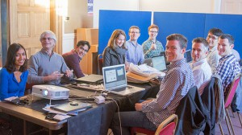
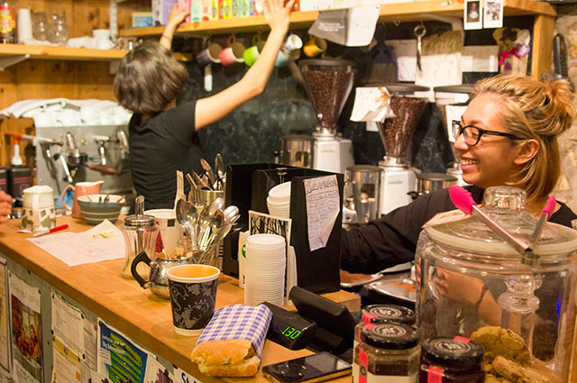

\[caption id="attachment\_753" align="alignright" width="300"\] UIST 2013 Doctoral Symposium - 小部屋に一日缶詰\[/caption\]

博士号の価値がいろいろ取り沙汰されているので、どう博士号を取ったか個人的な記録を書こうと思った…のですが、[ACM UIST 2013](http://www.acm.org/uist/uist2013/ "UIST 2013 - 26th Symposium on User Interface Software and Technology (October 8-11, 2013 St Andrews, UK)")のDoctoral Symposiumに参加した話が先ですね。

Doctoral Symposiumは、博士号取得が視野に入ってきた頃合いの学生が、博士論文や博士課程の学生生活、博士号取得後のキャリアパスに関する“大人”の意見を聞ける学会内イベントです。写真にあるようにかなり**こじんまりしたイベント**で、UIST 2013のときは学生8名、ホストの研究者3名でした。

ホストになる研究者は皆**分野でトップクラスの実力者**で、学生の研究内容に関するプレゼンを聞いて議論をリードしてくれます。そうして**博士論文のトピックのヒントを得る**というのが元々の主旨だったようです。僕はトピックが決まったあとだったのでちょっと時機を逸した感がありましたが、それを差し引いてもよい経験だったので記録を残しておきます。

ACMに**学会参加費全額と渡航費の一部を負担してもらえる**ので、応募しない理由はないですよ！ただし、ACM主催でもDoctoral Symposiumがある会議とない会議があるようなので、自分の分野の会議になかったら運が悪かったと思って諦めましょう…。

## Doctoral Symposiumの流れ

Doctoral Symposiumはポスターやデモ発表と同じ〆切で短い原稿を投稿し、採択されたら参加できます。この記事はACM UIST 2013での僕の経験に基づいて書いていきますが、だいたいどの会議でも同じようなものだと思います。たぶん。

1. [4ページ以内の原稿](http://junkato.jp/publications/uist2013-kato.pdf "Integrated visual representations for programming with real-world input and output")を書いて投稿（6月28日午後5時PDT〆切）
2. 採否通知を受領（7月26日）
3. [A1サイズのポスター](http://junkato.jp/publications/uist2013-kato-poster.pdf "Integrated visual representations for programming with real-world input and output")を作って印刷し、20分のプレゼン資料を用意（前々日の10月6日まで）
4. ホストの研究者とDoctoral Symposium参加者の学生たちとディナーで顔合わせ（前日、10月7日）
5. 小部屋に缶詰でDoctoral Symposiumに参加（10月8日）
6. 会期（10月9-11日）中、ポスターセッションで掲示して一般参加者からもフィードバックをもらう
7. 後日、原稿が[Digital Libraryに収録](http://dl.acm.org/citation.cfm?doid=2508468.2508476 "Integrated visual representations for programming with real-world input and output")

## ディナーで顔合わせ

UIST 2013のDoctoral Symposiumは、通常の会期の前日に開かれました。その前日のディナーで顔合わせをするので、通常会期より2日早く現地入りする必要があります。

ディナーはかなりギリギリにならないとスケジュールが決まらず気を揉みましたが、国際線の飛行機に乗るくらいの段になって「午後8時から学会会場近くのお店でディナーだよー」というメールが送られてきました。現地では、学生8人が全員初対面なのでかなり緊張しました。全部で3人のホスト研究者のうち2人が、[以前個人的にラボ訪問したことのある先生](http://www.cs.columbia.edu/~feiner/ "Steven K. Feiner")と[イケメンかつ面白い研究をしていることで一方的に知っていた先生](http://www.patrickbaudisch.com/ "Patrick Baudisch")だったのは救いでした。英語ネイティブの人にとっては「ディナーで予め打ち解けてから研究のガチトークをしよう」という自然な流れなんだと思いますが、ノンネイティブにはむしろ研究トークのほうがハードルが低いです…。

ディナーの初めにイケメン先生が **"Please think of this place as a kind of sanctuary."** と仰っていたのを覚えています。このシンポジウムは学生がさまざまなしがらみに影響されず自由な議論ができるよう配慮しているから、何でも安心して言える場所だということを分かってほしい、という趣旨でした。例えば、学生の指導教官はホストの研究者に入りません。こうして、博論が進まない原因に研究室の指導体制がある場合などに遠慮なく批判できるようにしています。（当日の議論で実際にそんな話が出ている学生がいました。）

## Doctoral Symposium当日

当日は、朝8時25分に集合して、8時半からきっちり始まりました。学生8人の原稿は、適宜参照できるようにDropboxで共有していました。

各学生には45分のタイムスロットが割り当てられています。標準的には、20分プレゼンして、そのあと25分は質疑応答と議論です。ホスト研究者だけでなく学生も質疑応答と議論に参加することを求められるので、一日気が抜けませんでした。

質疑応答と議論では、ざっくばらんな意見交換をします。プレゼンの仕方など、通常の研究発表では突っ込まれないようなポイントについてフィードバックがもらえるため、**ディフェンスの準備としてかなり有用だった**と思います。また、博論トピックが決まっていない学生は研究の進め方などメタな視点のコメントももらっていました。全体を通して、他の学生がどうやって博論トピックを考えているかだけでなく、他国の博士課程事情なども分かったりして大変面白かったです。

スケジュールはかなりタイトで、8時半から3人、30分休憩を挟んで11時15分から2人、1時間昼飯を挟んで、13時45分から3人…といった感じです。予定通りならこのあと16時から30分休憩して、17時まで全体での議論でしたが、1時間くらい押していたような気がします。

ちなみに、記事冒頭の写真は朝の様子で、みんなピンピンしています。夕方にはみんなヘトヘトでした。

## 会議会期中（Doctoral Symposium後）

Doctoral Symposiumが終わると、翌日から会議本体が始まります。Doctoral Symposiumに参加した学生の中には論文発表がある人もいて準備が大変そうでした。僕は論文発表はなかったのですが、博論執筆が修羅場だったので会場にいながら原稿を書いたり先生に相談したりしていて、会議に集中できませんでした…もったいなかったな。

会期中、ポスターセッションでは、Doctoral Symposiumで発表した内容をまとめたポスターを掲示して一般参加者と議論をします。他のポスター発表者と全く区別なく配置されたため、Doctoral Symposiumのことを知らない参加者には「何でこれいくつもプロジェクトが載ってるの？」というところから説明しなくてはならず面倒でした。**博論の内容を30秒で説明する練習として役立てる**のがいいと思います。

[Student Research Competition](http://junkato.jp/ja/blog/2014/05/04/acm-student-research-competition/ "ACM Student Research Competition参加のすすめ")もそうですが、学会が学生向けに用意してくれている様々な機会は、研究室から少し離れて**研究者として独り立ちするための練習**になることが多いです。ちょっとでも興味を惹かれたら、遠慮なく突っ込んでみるのがおすすめです！

\[caption id="attachment\_762" align="aligncenter" width="640"\] Doctoral Symposiumのあとは、偶然見つけた[大学生の溜まり場になっているカフェ](https://plus.google.com/104025028898671281343/about "Cafe Taste")で博論疲れを癒したのでした。\[/caption\]
