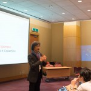
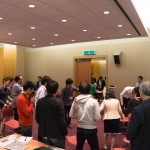
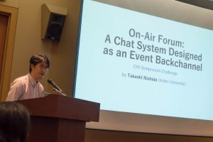
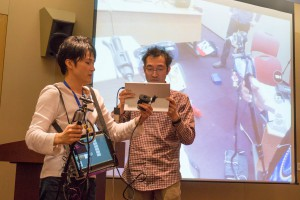
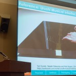
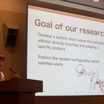
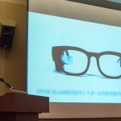
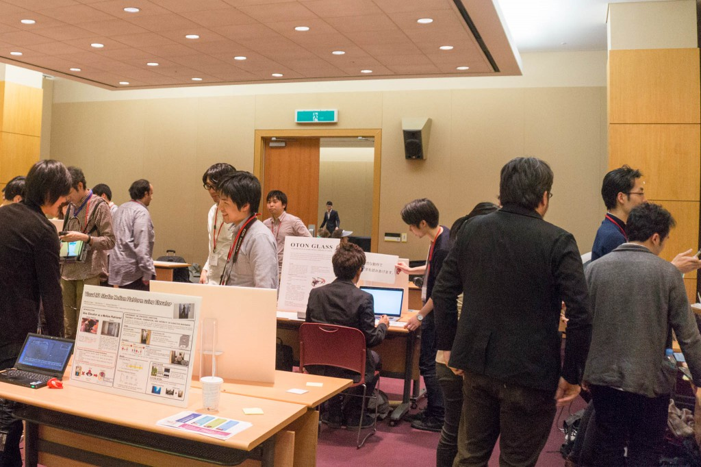
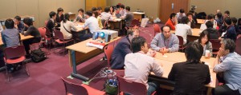
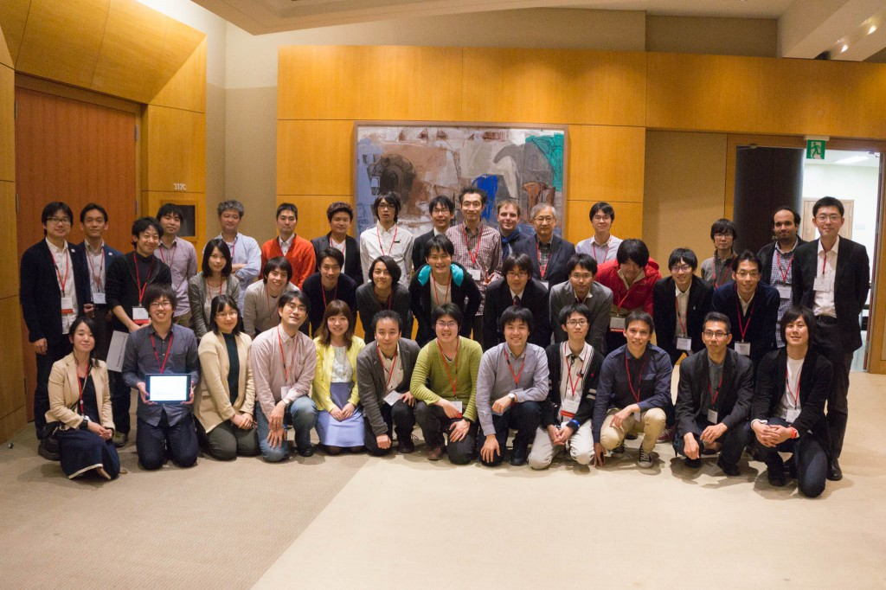

**7月3日追記:** [CHI勉強会 2015](http://hci.tokyo/seminar/chi2015/)ご参加ありがとうございました。情報処理学会の会誌7月号に[参加報告](http://id.nii.ac.jp/1001/00142321/)が掲載されました。本記事と合わせてどうぞ。

情報処理学会の学会誌向けに、Human-Computer Interaction分野で最大の国際会議である[CHI](http://chi2015.acm.org/)の参加報告を書いていたのですが、字数制限を気にしていなかったら溢れたので、省いた部分と[主催シンポジウム](http://hci.tokyo)の紹介をあわせてブログに掲載します。

元になったのはCHIにおける日本勢の活躍について書いた章で、分析、議論が主体だったので参加報告から削りました。それにしても「2100字前後」って短いですね…。

## CHI日本勢の活躍

[坂本による調査](http://daisukesakamoto.jp/articles/Analysis-of-Japanese-Research-Activities-on-the-CHI-Conference)では、CHIにおける日本人の活動は90年代が最も多く、その後緩やかに減少傾向にあることが指摘されています。内訳としては、企業からの論文が大幅に減少した一方で、海外で活躍する日本人が増えてきており、また、30代若手研究者が活躍しているとされています。

本年のCHIでも概ね同様の傾向が確認できましたが、さらに若い世代の活躍と、日本企業の研究開発部門からの注目の高まりを感じました。例えば、本年Best Paper Honorable Mention Awardを受賞した日本発の3本の論文（[AnnoTone](http://tealang.info/works/annotone.html), [FluxPaper](http://masaogata.com/projects/fluxpaper/), [TextAlive](http://junkato.jp/ja/textalive/)）はいずれも主著者が20代です。また、発表論文の著者所属を調べるとNTT、沖電気、東芝、富士ゼロックスといった企業が見つかるほか、後述するシンポジウムでも参加者40名中9名が大学以外の企業、研究所所属です。情報処理学会の参加報告でも書いたのですが、今後ますますHCIの技術移転、研究の社会実装が重要になってきます。今後もっと日本企業からの貢献が増えることが期待でき、楽しみです。

## Asian CHI Symposia

CHIは例年欧米で開催されてきましたが、今年は初めてアジア圏である韓国ソウルでの開催となりました。Asian CHI Symposiaは、これまで欧米開催のため足を運びにくかったアジア各国の研究者が集まって議論するため特別に設けられたシンポジウム群です。日本発で開催されたAsian CHI Symposiaは2つありますが、とくに著者が運営に携わった[ACM CHI Symposium on Emerging Japanese HCI Research Collection](http://hci.tokyo)について簡単に紹介します。

\[caption id="attachment\_948" align="alignleft" width="150"\] Opening\[/caption\]

\[caption id="attachment\_960" align="alignleft" width="150"\] Ice break\[/caption\]

本シンポジウムは、日本にゆかりのある（または興味のある）若手HCI研究者を集め、英語での発表・議論経験を積み、国際的に活躍する研究者との交流を深めることを目的としています。公用語は当然ながら英語です。Microsoftと情報処理学会の後援をいただいて開催することができました。

シンポジウムを始める前には、General ChairのJinwoo Kim氏が挨拶してくださったほか、二人一組で質問をし合うアイスブレイクを行ったことで参加者の雰囲気が一気に和らぎました。

また、国内会議WISSで利用されているチャットシステムやレポーター一人で使える中継システムのように、会議運営の方法を革新する試みを国外に輸出する場としても機能しました。

\[caption id="attachment\_949" align="alignleft" width="300"\] On-Air Forum\[/caption\]

\[caption id="attachment\_950" align="alignleft" width="300"\] Wearable Live Reporting System\[/caption\]

### 口頭発表

口頭発表では、日本の伝統素材である漆の導電性を利用して美しい電気回路を形成する技術や、トイレのお尻拭き自動化インタフェース、ネットで炎上して国際ニュースにもなった学会誌表紙デザインに関する議論など、日本ならではのさまざまなトピックが6件採択されました。

\[caption id="attachment\_952" align="alignleft" width="150"\] Urushi Circuit\[/caption\]

\[caption id="attachment\_951" align="alignleft" width="150"\] Tele-operated Bottom Wiper\[/caption\]

\[caption id="attachment\_953" align="alignleft" width="150"\] OTON Glass\[/caption\]

### デモ・ポスター発表

\[caption id="attachment\_955" align="aligncenter" width="1024"\] デモ・ポスター発表\[/caption\]

飛び入り1件を含む18件のデモ・ポスター発表が行われました。

\[caption id="attachment\_956" align="alignright" width="300"\] CHI 2030に向けての議論\[/caption\]

### CHI 2030

2030年のCHIに向けて建設的な議論が行われました。

### 国際会議におけるローカルコミュニティの役割

研究者が所属を意識せず参集し、専門性を活かして世界の未来について議論するのが国際会議の目的とするなら、国ごとの囲いを作るシンポジウムの開催はむしろその障壁となるという見方もあると思います。しかしCHI期間中には、Asian CHI Symposia以外にも、Scottish CHIなどの国別のイベントや、Carnegie Mellon Universityのような著名大学、Google、Microsoftといった大企業の主催イベントが非公式に多数開催されています。

このような特定コミュニティ向けのイベントは、科学的な知見を全員で共有しようとする本会議に対して相補的役割を果たしています。すなわち、文化的背景を共有しているという安心感のある環境が提供されることで、

- 新規参入者を国際的な研究コミュニティに紹介するきっかけを作り、
- 前提を省いた深い議論を行い、
- 祖国を離れた人々や企業OB・OGを交えた情報交換が行える

のです。ローカルなコミュニティが国際会議の中にあることで、グローバルな共同研究や人材流動性の確保に繋がるのではないでしょうか。

\[caption id="attachment\_957" align="aligncenter" width="1024"\] ACM CHI Symposium on Emerging Japanese HCI Research Collection参加者一同\[/caption\]

最後になりましたが、シンポジウムのスポンサーであるMicrosoftと情報処理学会に、主催者としてこの場を借りて御礼申し上げます。

\[caption id="" align="alignleft" width="180"\] スポンサー: Microsoft\[/caption\]

\[caption id="" align="alignleft" width="198"\] スポンサー: 情報処理学会\[/caption\]
