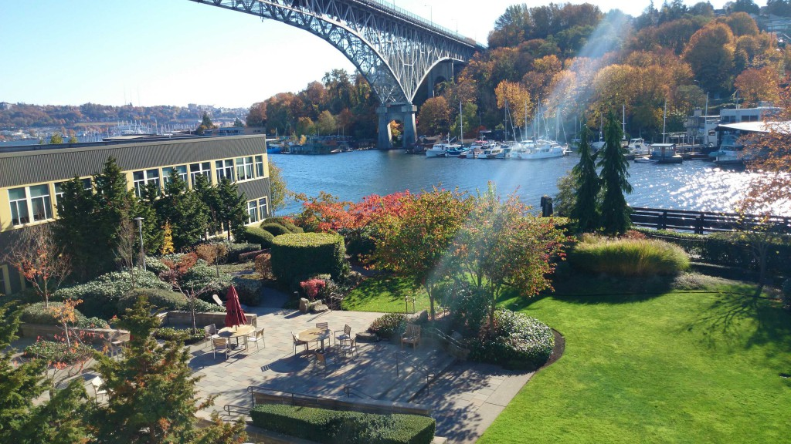
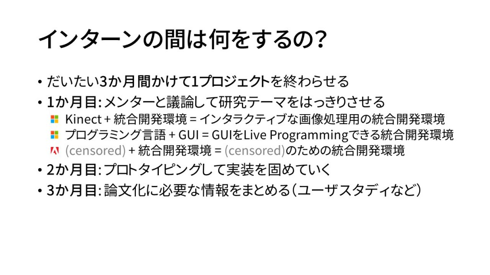
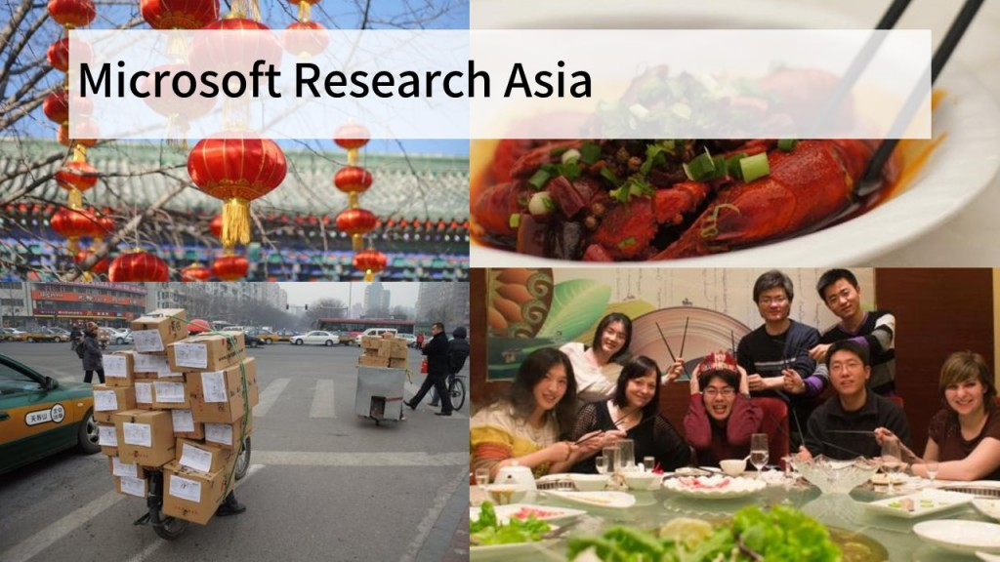
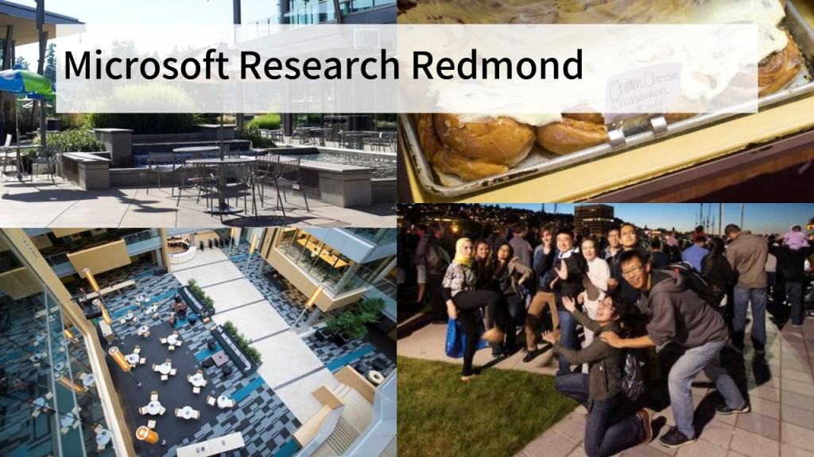
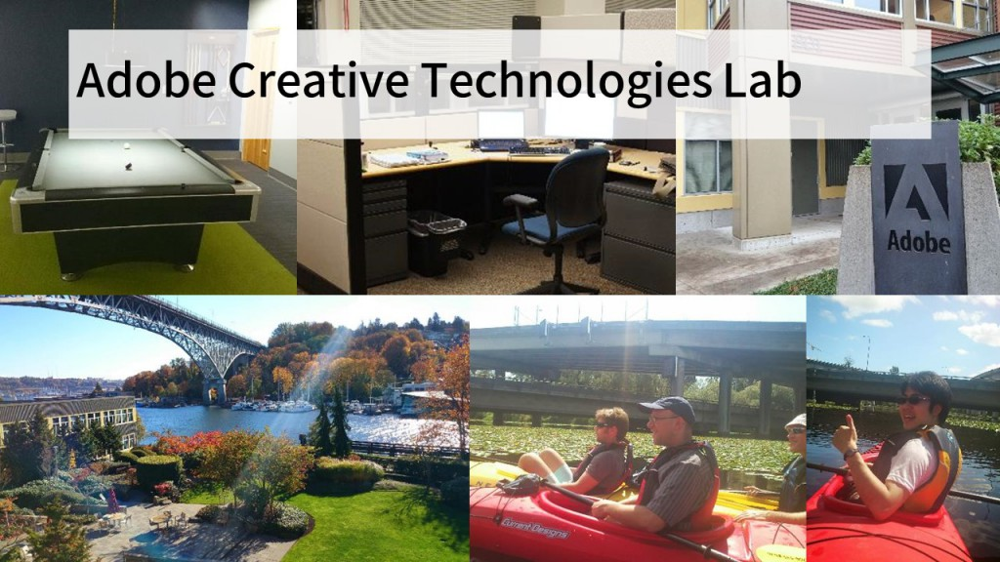
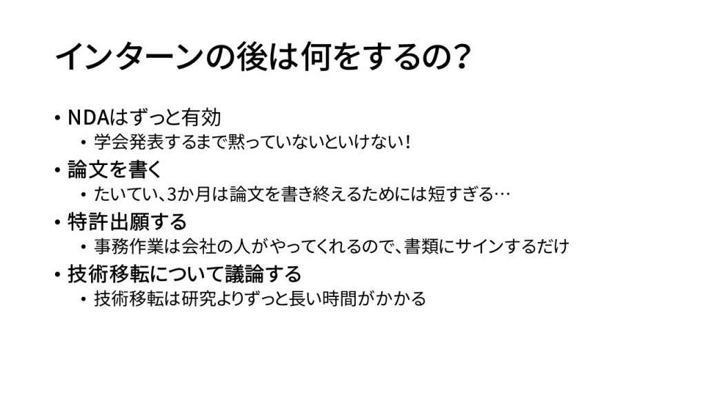
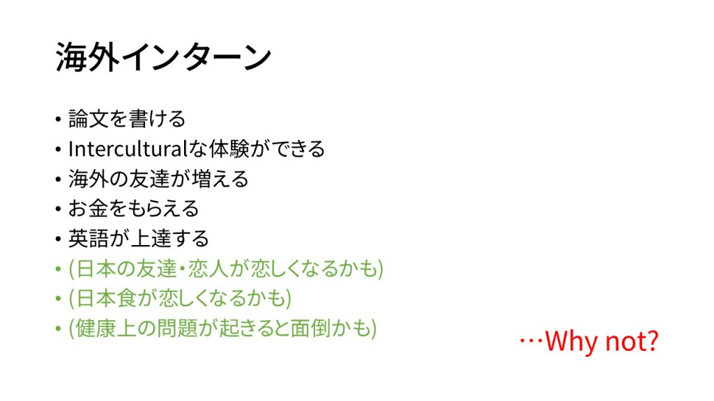

[前編](http://junkato.jp/ja/blog/2015/06/29/cs-research-internship-abroad/)では海外研究インターンの概要と、インターンに参加する方法・時期について紹介しました。後編は、もう少し具体的にインターン期間がどのように過ぎていくのか、そしてインターン期間後に何が起きるのか紹介します。

\[caption id="attachment\_1026" align="aligncenter" width="1024"\] Adobe Creative Technologies Lab Seattleオフィスから見た中庭\[/caption\]

## インターン期間中の過ごし方

インターン期間は大学の夏休みに合わせてだいたい3か月という企業が多いようです。

3か月は長いようですぐに過ぎてしまいます。まずメンターとなる研究者との顔合わせがあり、取り組む研究テーマの詳細を詰めていきます。僕の経験だと、実質本気で実装に取り組めるのは1か月で、それ以外はプロトタイピングやサーベイ、実装後のユーザスタディや論文執筆をしていました。研究がうまくいかない場合(たいていスムーズにはいきません)、実装後のあれこれは全くできないことも多いと思います。

何だか辛い話になってきましたが、3か月研究漬けではかえって能率が上がりません。現地ならではのあれこれを体験しながら日々を過ごすのがおすすめです。

\[caption id="attachment\_1012" align="aligncenter" width="1024"\] Microsoft Research Asia\[/caption\]

Microsoft Research Asia (MSRA)は、一番仲良くなった人たちが多かったです。研究所全体で見ると華人が圧倒的に多いですが、[Human-Computer Interaction Group](http://research.microsoft.com/en-us/groups/msrahci/)は韓国、アメリカ、フランス、イタリアなどさまざまな国から来ているインターン生が適度に近い距離感で、何度も連れだって遊びに行きました。

漢字文化圏なので、文字を見れば何となく意味が通じるのがいいですね。お寺などの史跡訪問も大変楽しかったです。北京の人たちは総じて親切でした。観光地では吹っかけてきますが、それはどこでも同じかもしれません。

\[caption id="attachment\_1013" align="aligncenter" width="1024"\] Microsoft Research Redmond\[/caption\]

Microsoft Research Redmondは、船を貸し切ってクルーズするレベルでインターン生の数が多く、日常的にコミュニケーションを取る人の数はかえって限られました。楽しかったですけどね。Asiaよりも居室なども広く、とにかく好待遇で生活で困ったことはありませんでした。…と言いたいところですが、個人的には、親不知が伸びて隣の歯を壊し、歯医者に通わなければならなくなったのが辛い思い出として残っています。麻酔と止血がうまくいかず、死ぬかと思いました。

夏のシアトル・レドモンドはカラッと晴れて過ごしやすい気温なので、最高の避暑地です。

\[caption id="attachment\_1014" align="aligncenter" width="1024"\] Adobe Creative Technologies Lab Seattle\[/caption\]

Adobe Creative Technologies Lab Seattleには、MSRA HCI Groupと近い規模のインターン生がいました。さすがCreativity Supportを仕事にしているだけあって、職場にビリヤード台があるなど、Microsoftよりお洒落でした。また、立地も水辺でとても気持ちよかったです。レドモンドと比べるとシアトルのダウンタウンに行きやすい場所で、それも便利でよかったなぁ。

## インターン後の過ごし方

インターン期間が終わったらメンター研究者との関係もすぱっと切れるかというとそんなことはありません。たいてい何かやり残したことがあるので、それを何とかします。例えば、論文執筆、特許出願、技術移転などがあるでしょう。アメリカで研究インターンをした場合、年度末には税金の還付手続きなどがあります。詳しくは[J-1ビザで渡米した研究インターンの所得税還付手続き](http://junkato.jp/ja/blog/2014/02/27/j1-trainee-tax-refund-docs-for-irs/)にまとめました。

メンター研究者とは、その後も国際会議などで何度も顔合わせすることになると思います。良好な関係を保てるといいですね。

## まとめ

海外企業での研究インターン、ぜひ行きましょう！

<blockquote class="twitter-tweet" lang="en">
Contact us for future collaboration opportunities! cc: <a href="https://twitter.com/Yuta_Sugiura">@Yuta_Sugiura</a> というわけでHCI分野の学生にはいろいろ選択肢があるよという宣伝でした。 <a href="http://t.co/AIhOrXc0Bz">pic.twitter.com/AIhOrXc0Bz</a>
— arc@dmz (@arcatdmz) <a href="https://twitter.com/arcatdmz/status/594048249574502401">May 1, 2015</a></blockquote>

海外に行く前に、まず国内というのもアリですね!!
