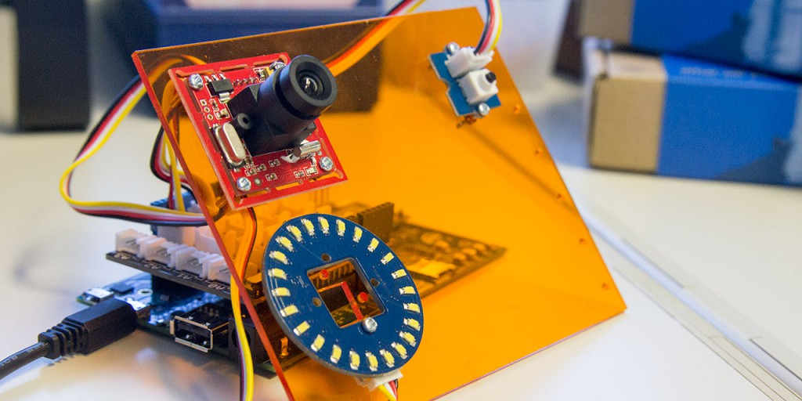

最近Intel Edisonのお世話になっています。JavaScriptで（ホストPCなしに）センサ・アクチュエータが動くのって本当に素敵ですね！

Intel EdisonやGalileoでは、GPIOなどを操作するために[mraa](https://github.com/intel-iot-devkit/mraa)という低レイヤーな通信用ライブラリを使います。簡単に入手できる有名なセンサ・アクチュエータごとにmraaを使ったコードをライブラリ化し、APIを整備したのが[upm](https://github.com/intel-iot-devkit/upm)です。`opkg update && opkg install upm`コマンドで最新版をインストールでき、オフィシャルに対応しているすべてのドライバが使えるようになります。

しかしながら、使いたいセンサ・アクチュエータがあるのにupmが対応していないケースがよくあります。そういった場合には、自分でupmを拡張するドライバを開発してGitHubでpull requestを送ることができます。しばらくするとupmにマージされ、そのうちIntel Edisonの初期設定で入るファームウェアでも当該センサ・アクチュエータが使えるようになります。みんな幸せになれますね。

mraaを使ってupmを拡張するための手順は一応すべてGitHubにあがっていますが、もう少し詳しく、日本語で解説してみます。なお、ホストPCでIntel Edison用にドライバをクロスコンパイルすることもできるかもしれませんが、とりあえず手軽に実機での開発方法を紹介します。今のところ、実機でも現実的な時間でコンパイルが終わってすぐ動作確認できるので、とくに問題を感じていません。

## opkgでGitをインストール

まずはGitをインストールするために、パッケージマネージャopkgの参照先URLを増やします。(情報元: [Edison opkg package repo created](https://communities.intel.com/thread/55692))

\[code language="bash"\]echo "src/gz all http://repo.opkg.net/edison/repo/all" >> /etc/opkg/base-feeds.conf echo "src/gz edison http://repo.opkg.net/edison/repo/edison" >> /etc/opkg/base-feeds.conf echo "src/gz core2-32 http://repo.opkg.net/edison/repo/core2-32" >> /etc/opkg/base-feeds.conf\[/code\]

そのうえで、Gitをインストールします。お手軽。

\[code language="bash"\]opkg update opkg install git\[/code\]

## mraaをgit clone, cmake, make install

情報元: [Building libmraa](https://github.com/intel-iot-devkit/mraa/blob/master/docs/building.md)

GitHubからソースコード一式を落としてきます。

\[code language="bash"\]cd ~/ mkdir github cd github git clone https://github.com/intel-iot-devkit/mraa.git\[/code\]

cmakeします。

\[code language="bash"\]cd ~/github/mraa/ mkdir build cd build cmake -DCMAKE\_INSTALL\_PREFIX:PATH=/usr ..\[/code\]

make installします。

\[code language="bash"\]cd ~/github/mraa/build/ make install\[/code\]

これで開発版のmraaがインストールされます。

## 環境変数を設定

upmのビルド時に参照される環境変数を設定します。

\[code language="bash"\]echo "PKG\_CONFIG\_PATH=$PKG\_CONFIG\_PATH:/home/root/github/mraa/build/lib/pkgconfig" >> ~/.profile echo "CPLUS\_INCLUDE\_PATH=$CPLUS\_INCLUDE\_PATH:/home/root/github/mraa/build/include" >> ~/.profile echo "LIBRARY\_PATH=$LIBRARY\_PATH:/home/root/github/mraa/build/lib" >> ~/.profile\[/code\]

このあとログインし直さない場合は`source ~/.profile`で読み込んでから作業を続けましょう。

## upmをgit clone, cmake, make install

情報元: [Building UPM](http://iotdk.intel.com/docs/master/upm/building.html)

**GitHub上で本家upmリポジトリを自分のアカウントにforkしてから**ソースコード一式を落としてきます。forkしておかないと後々`git push`できないので要注意です。

\[code language="bash"\]cd ~/github/ git clone https://github.com/arcatdmz/upm.git\[/code\]

`cmake`します。僕はPythonを使わないので`-DBUILDSWIGPYTHON=OFF`オプションをつけています。

\[code language="bash"\]cd ~/github/upm/ mkdir build cd build cmake -DBUILDSWIGPYTHON=OFF -DCMAKE\_INSTALL\_PREFIX:PATH=/usr ..\[/code\]

ここまではmraaと一緒ですが、このあとそのまま`make install`するとけっこう時間がかかります。全ドライバをビルドするためです。

\[code language="bash"\]cd ~/github/upm/build/ make install\[/code\]

必要なドライバだけビルドするためには、そのサブフォルダに入って`make install`します。

\[code language="bash"\]cd ~/github/upm/build/src/grovecircularled/ make install\[/code\]

ビルド方法が分かったので、あとはドライバを書くだけですね！

## upmを拡張する

情報元: [Making a UPM module for MAX31855](http://iotdk.intel.com/docs/master/upm/max31855.html)

`upm/src/`の中に新しいディレクトリを作ってC++のソースコードを書けばupmを拡張できます。例えば [groveultrasonic: Initial implementation](https://github.com/arcatdmz/upm/commit/add313ad6bbcd2ac4e7d4177b2beb9fd408b57d3) を見てみてください。これは、Groveの超音波測距センサを使えるようにしたドライバのpull requestです。

具体的には次のようにしてソースコードを書いていきます。

\[code language="bash"\]cd ~/github/upm/build/src mkdir groveultrasonic cd groveultrasonic vi groveultrasonic.cxx\[/code\]

使えるAPIは[mraaのドキュメント](http://iotdk.intel.com/docs/master/mraa/)を見てみてください。

また、PythonやNode.js用のモジュールを作るため、C++のソースコード以外にもいくつかファイルが必要になります。初めは似た処理をしているドライバのディレクトリをコピーして、それを改変していくのがいいと思います。なお、ディレクトリ名はそのままドライバ名になります。(cf. [命名規則](http://iotdk.intel.com/docs/master/upm/naming.html))

examples/c++/CMakeList.txt

C++用のサンプルコードをビルドするための情報が書いてある。

examples/c++/{modname}.cxx

C++用のサンプルコードを書く。MITライセンスの文面を忘れないように。`//! [Interesting]`で囲んだ範囲はサンプルコードとしてAPIリファレンスに転載される。

examples/{langname}/{modname}.py

{JavaScript,Python,Java}用のサンプルコードを書く。MITライセンスの文面を忘れないように。

src/{modname}/CmakeLists.txt

cmake用の設定を書く。ほぼコピペでよい。

src/{modname}/{modname}.{cxx,h}

C++でドライバを書く。本体。MITライセンスの文面を忘れないように。

src/{modname}/{js,py}upm\_{modname}.i

JavaScript, Pythonバインディングのための設定ファイル。ほぼコピペでよい。

## 本家upmにpull requestを送る

ファイルが揃ったら`git commit --signoff`します。`--signoff`オプションをつけることで[upmへの貢献に関する規約](http://iotdk.intel.com/docs/master/upm/contributions.html)に同意したとみなされます。

あとはforkした自分のリポジトリへ`git push`して、[GitHub上でpull requestを送れば](https://github.com/intel-iot-devkit/upm/pull/298)そのうち本家に取り込まれるかもしれません。
