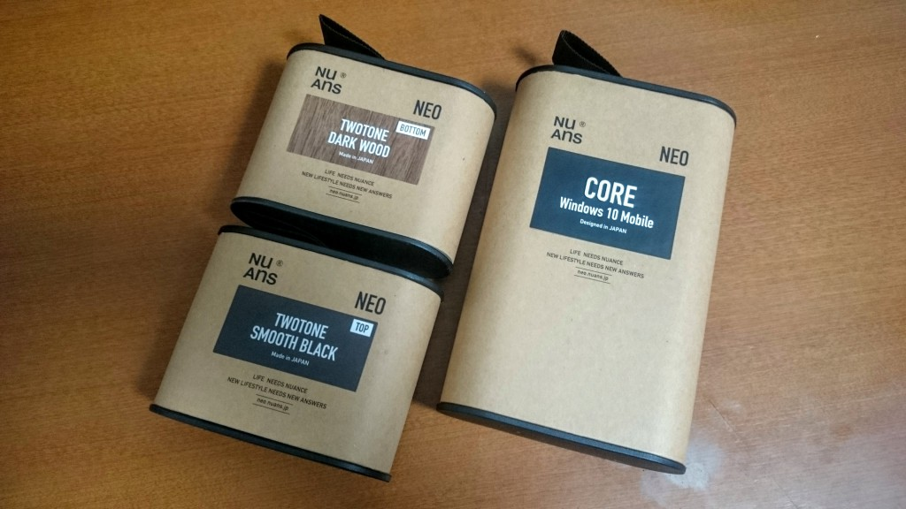
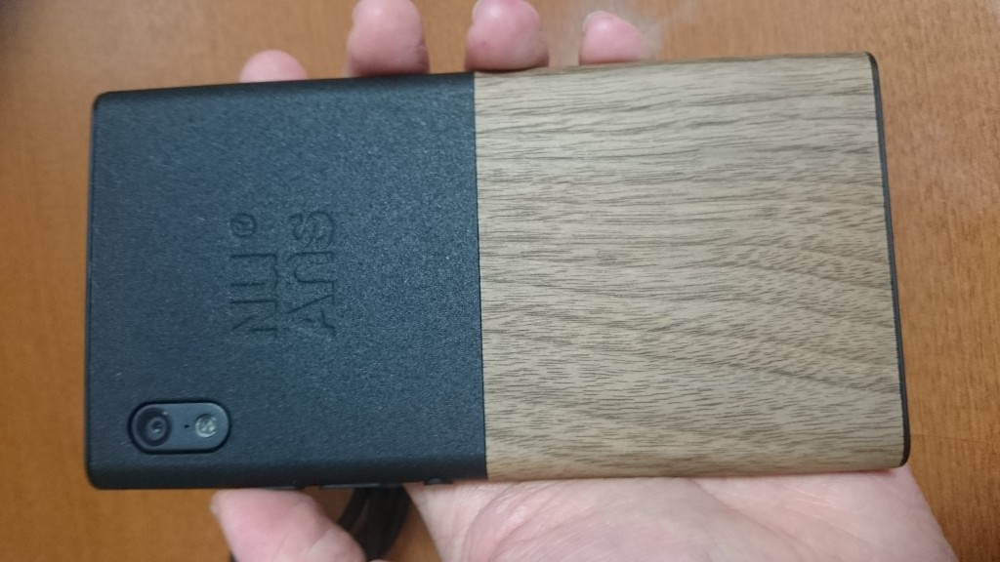
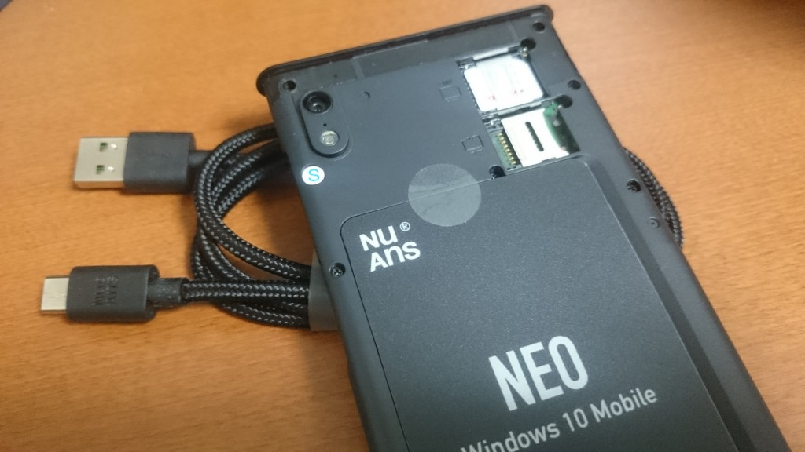
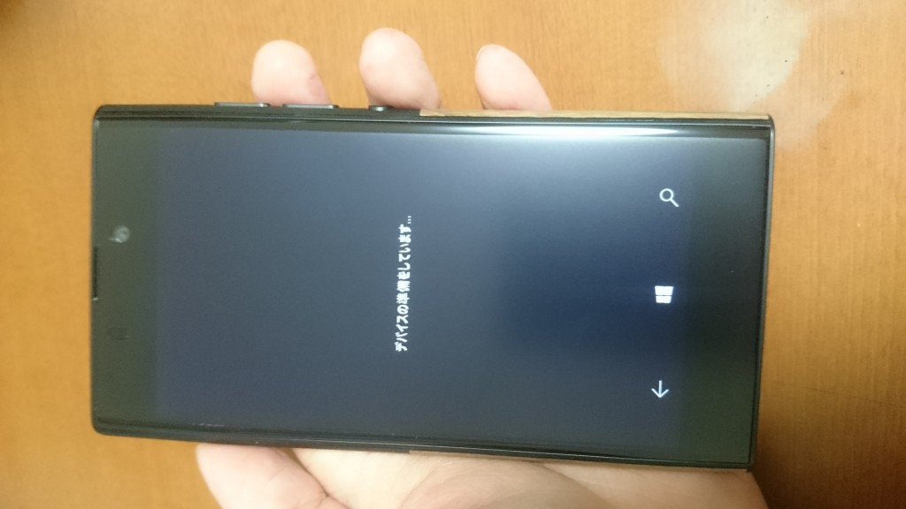

誘惑に負けてXperia Z1から乗り換えました。一週間ほど使ってみて、Windows 10 Mobile (NuAns NEO)のいいところ、悪いところなど見えてきたのでまとめておきます。

## 見た目と初回起動

まずNuAns NEOの見た目。すごく気に入ってます。各社金属質のスマートフォンをこぞって出してくるなかで、カバーの質感がとても暖かくていいです。冬は実際に手に持っても冷たくなくていい。重量バランスにこだわったというだけあって、手に持ったときの感触、感覚はとてもいいです。

裏側にSuica入れるところがあるのは別に要らんだろうと思ってましたが、実際に入れて使ってみると定期入れ出さなくて済むのが便利でした。付属のUSBケーブルがロゴ付きで丈夫そうなのもポイント高かった。

で、Windows 10 Mobileですが

SIMカードとmicroSDを挿入してから起動したらこのまま30分くらい固まってどうしようかと思いました。[1時間以上かかることもある](http://neo.nuans.jp/support/faq/115/)らしいですが、僕は我慢できず電源ボタン長押しして強制終了したあとSIMカードを抜いて起動し直してみました。そうしたらすぐ起動したので、終了して、SIMカードを挿し直したらふつうに起動しました。何に時間がかかってたんでしょうね。

## 日本語入力

慣れの問題もあると思うんですがちょっと使いにくい…誤入力が多いです。どうもしっかり上下左右にフリックしきらないと正しく認識されない感じで、最近はもう片手フリックは諦めて両手で使ってます。せっかくWindowsなのにATOKみたいな他社製IMEが使えないのもつらいところ。

あ、キーボードをスペースキー相当の領域の左右フリックで切り替えられるのはすごく便利です。

## アプリ

### Microsoft Office

オフィスアプリの出来はすごくいいです。ふだんPCで作っているファイルが全部開ける安心感は他にはないものだと思います。あとOutlookメールも便利に使えています。ただ、PCのOutlookとは全然違った使い勝手で、中身はむしろWindows 10の無料でついてくるメールアプリとほぼ同じに見えます。どういうブランディングなんだろうか。

### OneDriveとDropbox

Microsoft Officeをはじめとするファイルを読み書きするアプリからはOneDriveとDropbox上のファイルをローカルファイルと同じように開いたり保存したりできます。この2つのアプリも、とてもよくできています。

Office 365 Homeを契約してOneDriveの容量が1TB以上ある身としては、ここの使い勝手がそこそこいいのは実はかなり大事です。ちなみにOffice 365 Homeは月々1000円くらいで5人までの家族で使えて、各々にPC版Officeの最新版、OneDrive 1TB、Skype 毎月60分無料通話、Officeモバイルの機能制限開放がつくので、けっこうお得だと思います。…と思ったら、ふつうは日本じゃ買えないんですか、そうですか…。

### ニュース

ソースが産経新聞社に限られるのがどうもねぇ…と思ったら、他のソースもあるみたいでした。失礼しました。Androidでは日経新聞アプリを入れていてOS標準のニュースアプリはほとんど見ませんでしたが、あちらと比べたら使い勝手はいい、のかもしれません。

### Facebook

対応が半端で、一部のコンテンツを閲覧する際はEdge（ブラウザ）に飛ばされます。

### Facebook Messenger, LINE, Instagram BETA

それぞれAndroid版アプリと同程度の使い勝手です。よかったよかった。

### Map

なぜか解像度が低いんですが、どうにかなりませんかね？Windows 8.1の頃のマップよりはそこそこ使えるようになったかと思いますが、AndroidのGoogle Mapsが恋しくなります…。

### Google Maps, YouTube, Yahoo! 乗換案内…

全部アプリがないのでモバイルブラウザ向けページで利用することになります。もっさりかと思ったら、ブラウザがそこそこまともなおかげか、意外とサクサク動くし使い勝手よくて驚きました。でも、やっぱりネイティブアプリが欲しいところです。

### Skype, Skypeビデオ, メッセージ

全部似てるようで別のアプリです。SkypeビデオはSkypeからビデオ通話機能だけ取り出した感じですが、もしかして携帯電話会社のビデオ通話サービスもこのアプリで使えるんでしょうか。メッセージは基本的にSMSやMMSに使うものですが、Skypeビデオのセットアップが終わっているとSkypeのメッセージも読み書きできます。ただ、Skypeの一覧にはあった会話が一部見えなかったり、微妙に不具合が…これがなければSkypeアプリ入れずに済むんですが。

### Mimosa

[IIJmioの利用状況を表示できるアプリ](https://www.microsoft.com/ja-jp/store/apps/mimosa/9nblggh1mk3v)です。

### Kumalica

[Suicaの利用状況を表示できるアプリ](https://www.microsoft.com/ja-jp/store/apps/kumalica/9nblggh5ckz9)です。

## その他

### カメラ

悪くはないんでしょうが、Xperia Z1のほうが綺麗でした。2016年1月発売のモデルが2013年9月発売のモデルに負けるというのはちょっといただけない…これはWindows 10 MobileというよりNuAns NEO(ハードウェア)の問題ですね。

### バッテリー

持ちます。自分の使い方だと、一日くらい充電忘れても大丈夫です。

### 配色

OSの配色を白ベースと黒ベースから選べます。ほとんどのアプリもこの設定を尊重して配色を変えてくれます。

暗いところで白背景に黒文字の画面を見てると目が痛くなるので、これは地味に嬉しい機能でした。

### テザリング

USBの有線でテザリングするメニューがないです。あと無線のテザリングがしばしば不安定になります。再起動すると直るけど…。

### Windows Update

自然に使えているところ以外ばかりが目に付くということで、いろいろ文句を言いましたが、期待の裏返しですから！

何だかんだでWindowsと同じようにMicrosoftのアップデートが定期的に配信されそうなので、だんだんよくなっていくとは思います。

### バックアップと復元

Windows 10 Mobileは、OneDriveにアプリの設定やスタート画面のタイルの配置情報などをバックアップできます。

どうやってもスピーカーから音が鳴らないので、電話のリセットを行ったところ、初回起動時にMicrosoftアカウントにログインしたら「復元」のためのメニューが現れました。復元を試みたところ、タイルの配置は完璧に復元されました。アプリのログイン情報は消えていたので、LINEのトーク履歴などは復元できず。ただ、ぜんぜん復元がうまくいかないAndroidと比べればマシな「復元体験」だったと思います。

ちなみに、音が鳴らないのは初期不良ということで、本体交換していただきました。メイン機にしようとしていたところだったので、本体がなくなる期間が長いと困るのですが、幸い数日で新しいのがきてよかったです。
