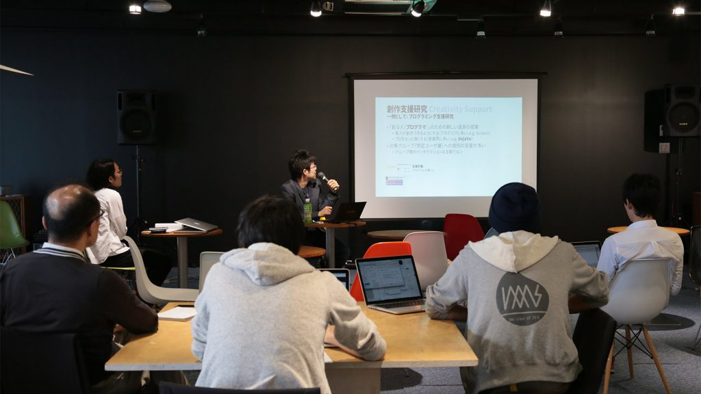
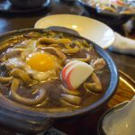
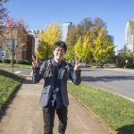
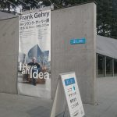
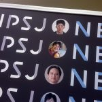

研究員として働き始めて二年が経ちました。[実は半年前にも振り返っている](http://junkato.jp/ja/blog/2015/10/01/half-yearly-review-2015/)ので、そのあとの半年で何があったかまとめておきます。

[TextAlive × SNOW MIKU 2016](http://textalive.jp/snowmiku2016)でイラストレーターの方々、音楽家の方々と間接的にでも共同で創作できたこと、[SIGPXを立ち上げられた](http://junkato.jp/ja/blog/2016/03/05/sigpx1/)こと、プログラミング環境研究について[IPSJ-ONEで語り](http://junkato.jp/ja/blog/2016/03/16/ipsj-one-px-science-as-a-service/)、ジャーナル原稿にまとめられたこと、が最も印象に残っています。安定軌道に乗ってきた気がしますが、研究・デプロイ(研究成果を誰でも使えるようサービス化)・その他の事務タスクのバランスをうまく取らないと、新しい研究をどんどん出していくことが難しくなりそうです。

もともとHCI研究者として超多産というわけでもなく、一年に一新規テーマを研究からデプロイまでこなしているペース（TextAlive, f3.js）ですが、三年目はペースを落とさないようにこれまでの蓄積を生かした新規テーマに取り組みたいと考えています。

\[caption id="attachment\_1204" align="aligncenter" width="1024"\] IAMASで講演させていただいたときの写真。お洒落空間でした。ここで話すためにまとめた内容はIEEE Computerジャーナル特集の原稿に色濃く反映されています。（2016年7月刊行予定）\[/caption\]

## 半年間のお仕事

だいたい次のとおりです。

- 学術発表
    - ACM UIST 2016デモ発表「[Form Follows Function(): An IDE to Create Laser-cut Interfaces and Microcontroller Programs from Single Code Base](http://dl.acm.org/citation.cfm?id=2817797)」
    - インタラクション2016 口頭発表 主著「[IoTアプリケーションのソフトウェア・ハードウェアを単一コードベースで開発できる統合開発環境f3.js](http://f3js.org)」ベストペーパー**候補**
    - インタラクション2016 デモ発表 共著「[Nightbird Audience Node: 観客がVJの即興映像プログラミングを支援するシステム](https://fukuchilab.org/projects-j/nightbirdaudiencenode-j)」インタラクティブ発表賞（PC推薦）
    - IEEE Computerジャーナル 2016年7月号特集 ["User Interface Design in the 21st Century"](https://www.computer.org/web/computingnow/cocfp7) に "Programming with Example for Development of Data-intensive User Interfaces" が採択
- イベント
    - [TextAlive × SNOW MIKU 2016](http://textalive.jp/snowmiku2016) ([カフェ上映](http://miraist.com/2016/02/textalive)、piapro連携)
    - [第5回名状しがたいお茶会](http://junkato.jp/ja/teaparty/)
    - [第1回SIGPX](http://sigpx.org/1/)（**ブログ記事**: [第1回SIGPXを開催しました](http://junkato.jp/ja/blog/2016/03/05/sigpx1/)）
-  講演
    - [IAMAS](http://www.iamas.ac.jp/)特別講演「三つ巴のインタラクションデザイン」
    - [明治大学FMS](http://www.meiji.ac.jp/ims/subject/fms/)講演「\* as a Code」
    - [IPSJ-ONE](http://ipsj-one.org/)招待講演「コンピュータを変幻自在の道具にするためのプログラミング環境技術」（**ブログ記事**: [情報処理が科学を更新する（IPSJ-ONEに登壇しました）](http://junkato.jp/ja/blog/2016/03/16/ipsj-one-px-science-as-a-service/)）

## 学会関連のお仕事

いろいろな委員を頼まれることが明らかに多くなってきました。申し訳ないのですが、すでにキャパオーバーな気がするのでこれ以上はしばらく（数年間？）お断りせざるを得ない気がします。。

- [SIGPX](http://sigpx.org)幹事
- [CHI勉強会](http://hci.tokyo/seminar/chi2015/)幹事
- [IPSJ-ONE](http://ipsj-one.org)運営委員
- [ACM CHI 2016 Symposium on Emerging Japanese HCI Research Collection](http://hci.tokyo/chi2016/) Program Committee
- [ACM UIST 2016](https://uist.acm.org/uist2016/) Student Volunteer Chair
- ECOOP 2016 [The 1st Edition of the Programming Experience Workshop (PX/16)](http://2016.ecoop.org/track/PX-2016) Progam Committee
- ECOOP 2016 [The 2nd Workshop on Live Programming Systems (LIVE 2016)](http://2016.ecoop.org/track/LIVE-2016) Progam Committee
- [ACM ISS 2016](http://iss2016.acm.org/) Publicity Co-Chair
- [WISS 2016](http://www.wiss.org/WISS2015/) 運営委員・プログラム委員
- [ACM CHI 2017](https://chi2016.acm.org) Committee on "Engineering Interactive Systems" Associate Chair
- [ACM/IEEE HRI 2017](http://humanrobotinteraction.org/2016/) Demonstration Co-Chair

これ以降は月ごとの振り返りです。お暇な方のみどうぞ:)

\[caption id="attachment\_1208" align="alignright" width="150"\] 友人お薦めの味噌煮込みうどん、麺にコシがあって美味。\[/caption\]

## 10月

[プレスリリース](http://www.aist.go.jp/aist_j/press_release/pr2015/pr20150908/pr20150908.html)が終わってようやく落ち着いた頃です。新しい研究ネタを考えたり、若手研究者を支援するための制度の欠陥をまとめて知り合いの先生にフィードバックしたりしていました。

プライベートでは、癌を患った友人を見舞いに行きました。また、前々から行ってみたかった[IAMAS](http://www.iamas.ac.jp/)が近くにあったので、頼み込んで訪問する機会を得ました。さらに光栄なことに、その頃考えていたことを講演するチャンスをいただきました。このときまとめた内容は、後々のジャーナル原稿に深く反映されています。

WISSプログラム委員会もありました。自分の論文が落ちるのをほぼリアルタイムで知るという稀有な体験…まぁ[f3.js](http://f3js.org)なんですけど。具体例がなく良さが伝わっていなかったので、この月のうちに所内ワークショップを開催しました。その結果を反映してかなり書き直した原稿を、翌月頭にインタラクション2016へ投稿しました。

\[caption id="attachment\_1209" align="alignright" width="150"\] ACM UIST 2016会場近くで。めっちゃ楽しそうですね。\[/caption\]

## 11月

研修がありました。研究所って同期がけっこういるので、入所年度ごとに研修があるんです。詳しくは書けませんが、とても面白かったです。ふだんは交流がないような部門やバックオフィスの人たちとも話ができる貴重な機会です。

ACM UIST 2015で[f3.js](http://f3js.org)をデモ発表しました。UISTは何度も行っているので顔なじみが多く、色々な人の近況が聞けるので楽しいです。また、UIST 2016でStudent Volunteer Chairを拝命しているので、UIST 2015 SV Chairと会って簡単な引継ぎをしました。ちょっとだけ空いた時間で[Bechtler Museum of Art](http://www.bechtler.org/)に行くことができたのですが、Sam Francisの企画展をやっていて非常によかったです。

他には、これまで進めてきたプログラミング環境研究をまとめたジャーナル原稿を書くことを決めたり、プログラミング環境関連のスタートアップのCEOが来日するのでベンチャーキャピタルに呼ばれて引き合わせてもらったり、[名状しがたいお茶会](http://junkato.jp/ja/teaparty/)の下見でWantedlyにお邪魔させてもらったりしました。

プライベートでは、花貫渓谷に紅葉を見に行ったりしてました。あと、[スターウォーズ バトルフロント](http://starwars.ea.com/ja_JP/starwars/battlefront)の映像の美しさに衝撃を受けて、PSP時代からずっとプレイしてみたかった[Gravity Daze](http://www.jp.playstation.com/scej/title/gravitydaze/)が移植されることを知って、ダブルスコアで閾値を超えたのでPS4を注文しました。Xbox 360（Microsoft Researchにインターンしたお土産でもらった！）で[Skyrim](http://www.elderscrolls.com/skyrim/)をプレイしたときにも美しさに感動したものですが、さらに輪をかけてグラフィックが進化していてすごいですね。どんな環境で制作されているのか気になります。ちなみにFPSの類はやったことがありませんでした。（このあと滅茶苦茶殺された）

\[caption id="attachment\_1210" align="alignright" width="150"\] PS2が引退してPS4がデプロイされました。Xbox 360, Wii, SFCも現役です。\[/caption\]

## 12月

明治大学で「\* as a Code」と題して学部生に講義しました。ただ、どんな聴衆を想定して講義したらいいか直前まで悩んでしまい、ちょっと半端な内容に…反省は、後日のIPSJ-ONE登壇発表に活かさせていただきました。

また、f3.jsについて、[WISS 2015](http://wiss.org/WISS2015/)でデモ発表したほか、[JS Board Shibuya](https://geechs-magazine.com/tag/event/20151221)という主にエンジニアの方が集まるイベントで登壇発表しました。

あとは、プログラミング環境研究に関するジャーナル原稿のドラフトを書いていました。[SIGPX](http://sigpx.org/1)の準備も。

プライベートでは、家のPCをアップグレードしました。いろいろな用途に使っているのでプライベートとは言えないかも。。Core i7 6700K, 8GB 4枚組, 240GB SSDなど、かなり長持ちしそうな強い構成になりました。そういえばSoftBankをやめて妻もろともIIJmioに一本化しようと決めたのもこの月でした。事務手続きの関係で、実際にやったのは翌月頭。

\[caption id="attachment\_1211" align="alignright" width="150"\] 21\_21 DESIGN SIGHTのフランク・ゲーリー展、とてもよかったです。\[/caption\]

## 1月

ジャーナル原稿をブラッシュアップして投稿しました。また、[SIGPX](http://sigpx.org/1)と[名状しがたいお茶会](http://junkato.jp/ja/teaparty/)の準備をしていました。名状しがたいお茶会の国際化を見据えて、英語縛りの小規模茶会を開いたのもこの月でした。[TextAlive](http://textalive.jp)の実装も若干アップデートしました。あまり無茶することもなく静かな年の始めになりましたが、今にして思えば翌月からの嵐の前兆はあったんですよね…。

プライベートでは、中学高校時代の友人とスキーに行きました。久しぶりに体を動かして、その後しばらく体調がよかったです。やっぱり動かないとダメだなぁ。これからは運動も頑張りたいです。（と言ってはや○年が経過）

\[caption id="attachment\_1219" align="alignright" width="150"\] MIRAI.ST cafeでTextAliveが壁面に大写しになっていたそうです。嬉しい。\[/caption\]

## 2月

[TextAlive × SNOW MIKU 2016](http://textalive.jp/snowmiku2016)企画に奔走しました。また、[f3.js](http://f3js.org)の実装を作り直しました。さらに、技術研修生（インターン生のようなもの）たちがきたので、研究テーマを決めたり、相談に乗ったりしました。もうちょっと積極的に関わってあげたほうがよかったのかな、と、これは実習期間終了時に反省。それでも、とても面白いものを作って見せてくれました。

中旬には[名状しがたいお茶会](http://junkato.jp/ja/teaparty/)、月末には[SIGPX](http://sigpx.org/1)がありました。僕はあまりイベントやる人ではないのですが、この二つだけは例外で、時期がかぶっちゃって大変でしたがどちらも盛会になって嬉しかったです。

プライベートでは、月の頭にWindows 10 Mobileを採用した[NuAns NEO](http://neo.nuans.jp/)が届きました。使い勝手？聞いてはいけません。愛ですよ、愛。（**ブログ記事**: [Windows 10 Mobile端末(NuAns NEO)を買った](http://junkato.jp/ja/blog/2016/02/11/windows-10-mobile-nuans-neo/)）

\[caption id="attachment\_1212" align="alignright" width="150"\] こんなところにも自分の顔が。いい経験でした。\[/caption\]

## 3月

インタラクション 2016で[f3.js](http://f3js.org)について登壇発表しました。惜しくもベストペーパーを逃したそうで（会議冒頭で、ベストペーパー候補という何とも微妙な紹介のされ方…）、悔しいですが仕方ありません。共著の[Nightbird Audience Node](https://fukuchilab.org/projects-j/nightbirdaudiencenode-j)がインタラクティブ発表賞（PC推薦）を受賞したのが嬉しかったです。小渕君よく頑張った。f3.jsはインタラクション会期中も実装を続け、限られた人数の方々にα版公開を始めました。

IPSJ-ONEで登壇発表したのも、[前のブログ記事](http://junkato.jp/ja/blog/2016/03/16/ipsj-one-px-science-as-a-service/)で書きましたが、大きな出来事でした。研究会推薦というのは大変名誉なことですが、同時にプレッシャーも大きく、5分という短い時間でどう研究の魅力を伝えるか、アウトリーチの訓練になりました。他分野の優秀な研究者と知り合えたのも収穫でした。

実習生が帰っていったタイミングで、改めて癌の友人のところに見舞いへ。新たな出会いもあり貴重なお土産までもらってしまいました。と、ここで急に発熱。2月からちゃんと休めていなかったので、疲れが出たんでしょうね。病床に臥せってしまいました。

風邪と戦いながらジャーナル原稿Major revisionを必死の思いで投稿。けっきょくこれはそのまま採択されました。IEEE Computer 2016年7月号の特集 ["User Interface Design in the 21st Century"](https://www.computer.org/web/computingnow/cocfp7) に載る予定です。

あとは、所内のお仕事をやったり、f3.jsのUIST原稿を書いたりしていました。

というわけで、3年目も頑張っていきます。
