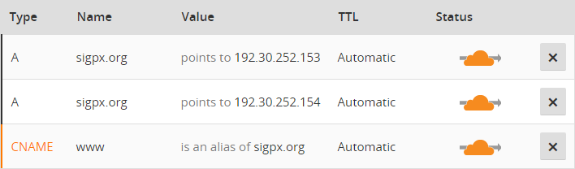

これまでHTTPでホストしていた研究会サイト [sigpx.org](https://sigpx.org) と個人サイト [junkato.jp](https://junkato.jp/ja) をHTTPS化しました。前者はCloudflare、後者はLet's Encryptを使いました。どちらも無料でした。

できればCloudflareで統一したかったのですが、事情があって別々の方法を取りました。また、手順自体はシンプルだったのですが、単純に移行するとはてなブックマークやFacebookのLikeなどが引き継がれないので、その対応が少々面倒くさかったです。

## CloudflareでGitHub PagesをSSL化

[SIGPXのWebサイト](https://sigpx.org/)はGitHub Pagesでホストしています。GitHub Pagesは github.io のサブドメインであればSSLでアクセスできます（例: [https://sigpx.github.io](https://sigpx.github.io)）が、独自ドメインを使うと直接はSSL化できません。

Cloudflareを使った具体的なSSL化の方法については[すでに日本語の記事がQiitaなどにあがっている](http://qiita.com/noraworld/items/89dd85a434a7b759e00c)のでそれを参照すると簡単だと思いますが、[英語ならCloudflare自身の ブログ記事もあります](https://blog.cloudflare.com/secure-and-fast-github-pages-with-cloudflare/)。

仕組みとしては、独自ドメインの名前解決をするときにCloudflareのネームサーバを見に行くようにすることで、HTTPであれHTTPSであれ、アクセス時にGitHub PagesのサーバではなくCloudflareのサーバへアクセスが飛ぶようにしています。

そして、以下のように、CloudflareがリバースプロキシとなってブラウザとGitHub Pagesサーバ間の接続を仲介することで、もともとのGitHub Pagesと同じコンテンツへのアクセスが可能となっています。

\[caption id="attachment\_1402" align="aligncenter" width="307"\] [What do the SSL options mean? - Cloudflare Support](https://support.cloudflare.com/hc/en-us/articles/200170416)\[/caption\]

設定の途中で、独自ドメイン契約先でネームサーバの設定を変更する作業が必要です。[お名前.com](https://www.onamae.com/)の場合は、「ドメイン設定」「ネームサーバーの設定」「ネームサーバーの変更」からネームサーバーをCloudFlareに指定されたものに変更します。

最終的にCloudflare上のDNSに関する設定は次のようになります。

あとはサイト上で参照しているすべてのリソースがHTTPSで統一されていることを確認します。（そうしないとブラウザのアドレスバーに[「安全でない通信路」の情報](http://www.atmarkit.co.jp/ait/articles/1609/23/news023.html)が出続けます。）

GitHub PagesもCloudflareも無料の範疇で転送データ量の制限などがあるようですが、ふつうに使うぶんには全く問題なさそうです。

## Let's Encryptでさくらインターネットの共有サーバ上のサイトをSSL化

さくらインターネットのスタンダードプランでホストしている個人サイト [junkato.jp](https://junkato.jp/ja) もCloudflareでSSL化できれば簡単だったのですが、そうはいきませんでした。設定後、Cloudflareの「Error 1000」が出るようになったのです。[まったく同じ問題で困った人のブログ記事](https://my.iesaba.com/posts/sakura-shared-server-very-bad)があって助かりました。記事から引用すると、起きている現象は以下のとおりです。

> 1. クライアントがさくらのレンタルサーバ(https)に対して要求を送信する
> 2. さくらのレンタルサーバ(https)の443番ポートは80番ポートへのプロキシなので名前解決を行う
> 3. 名前解決した結果、当然CloudFlareのIPアドレスが返ってくるので、そのアドレスを使用しhttpで接続を試みる
> 4. CloudFlare(http)はさくらのレンタルサーバ(http)へ接続を試みてコンテンツを取得する

後で知ったのですが、[サイト全体をWordPressで運用している場合はさくらインターネットの公式プラグインがある](https://ja.wordpress.org/plugins/sakura-rs-wp-ssl/)ようです。自分の場合はそうではなかったので、Cloudflareを諦めてLet's Encryptで証明書を取ることにしました。

SSL化自体は、Qiitaで[「さくらレンタルサーバーに独自SSL「Let's Encrypt」導入(Windows10編)」という記事](http://qiita.com/bass-inu/items/43637b3ceb9fa7cf05c7)を書いている方がいたので手順に従うだけでとても簡単でした。

## はてなブックマークとFacebook Likes

WebページのURLが変わる（httpがhttpsになる）ので、これまでのブックマーク数やLikesは引き継げません。ただ、見た目上引き継ぐことはできます。

はてなブックマークの場合はウィジェット表示部の a タグに data-hatena-bookmark-url 要素を設定するとブックマーク対象のURLを変更できます。（[ボタン設置用フォーム](http://b.hatena.ne.jp/guide/bbutton)の「保存するURL」欄に対応）

Facebookの場合は同様に data-href 要素を設定します。（[Share Button Configurator](https://developers.facebook.com/docs/plugins/share-button)のURL to shareに対応）

静的なページの場合は個別にこの対応をしていけばよいのですが、問題はWordPressで運用しているブログ（このページ）でした。HTTPS化する前のページはHTTPのURLで、HTTPS化したあとのページはHTTPSのURLでシェアボタンの類を設置したいので、利用している[WP Social Bookmarking Light](https://wordpress.org/plugins/wp-social-bookmarking-light/)のソースコードを編集して対応しました。

変更点は以下のとおり:

[https://github.com/arcatdmz/WP-Social-Bookmarking-Light/commit/d48293c05cde3fbe41a4ab8622cac488f6a71549](https://github.com/arcatdmz/WP-Social-Bookmarking-Light/commit/d48293c05cde3fbe41a4ab8622cac488f6a71549)

日付の判定は[Service.phpの50行目](https://github.com/arcatdmz/WP-Social-Bookmarking-Light/blob/d48293c05cde3fbe41a4ab8622cac488f6a71549/src/WpSocialBookmarkingLight/Service.php#L50)で行っています。

そんなわけで、意外と考えることは多かったですがちゃんとHTTPS化できました。Let's Encryptの証明書更新も自動化したいのですが、さくらインターネット側がAPIのようなかたちで対応してくれないと難しいかもしれません。（ヘッドレスブラウザでログインから自動化する？）
