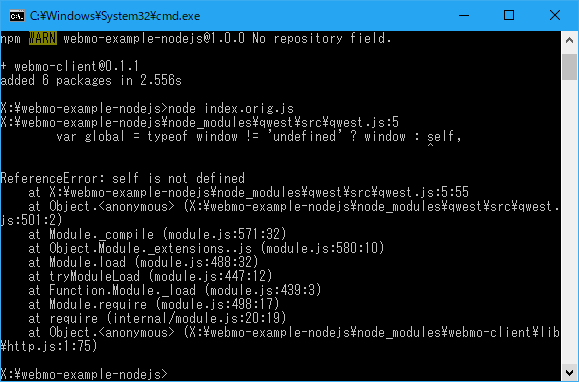

[昨日の記事](https://junkato.jp/ja/blog/2017/07/19/webmo/)でも紹介した[Webmo](http://webmo.io/)はJavaScriptで簡単に操作できることがウリですが、現状用意されているライブラリはブラウザ上で動作することを前提に設計されており、Node.jsで実行するとエラーが起きます。

エラーを直して本家にpull requestを送ろうと思っていたのですが、そう簡単ではなかったので、Node.js用に移植した新しいnpmパッケージ [webmo-client-nodejs](https://www.npmjs.com/package/webmo-client-nodejs) を作って公開しました。

\[caption id="attachment\_1422" align="aligncenter" width="579"\] 依存ライブラリがブラウザ前提に設計されているため、[サンプルコード](https://github.com/arcatdmz/webmo-example-nodejs/blob/master/index.orig.js)を実行すると  
ReferenceError: self is not defined というようなエラーが出ます。\[/caption\]

## 変更点

- 本家 [webmo-client](https://github.com/cidreixd/webmo-library-javascript) が依存していたqwestやQといったブラウザ用ライブラリを一掃して、websocketのようなNode.jsで足りていないライブラリを読み込むようにしました。
- 開発言語をJavaScriptからTypeScriptにしました。
- ビルド時、ブラウザ用にwebpackで固めていたのをtscでコンパイルするだけにしました。

詳しくは[GitHubのCommits](https://github.com/arcatdmz/webmo-library-nodejs/commits/master)を見てみてください。

## require('webmo-client-nodejs')

変更点は上の通り表層的な部分だけなので、実際の使い方は本家とほぼ同じです。ブラウザ用に `require('webmo-client')` と書いていた部分を `require('webmo-client-nodejs')` とすれば同じJavaScriptコードが動きます。サンプルコードを [webmo-example-nodejs](https://github.com/arcatdmz/webmo-example-nodejs) に置きましたが、めちゃくちゃ短いのでこちらにも貼っておきます。Webmo便利ですね！

\[code language="javascript"\]var WebmoWs = require('webmo-client-nodejs').ws var motor = new WebmoWs("webmo.local")

motor.onopen = () => { motor.rotate(90) setTimeout(() => { motor.stop(); motor.close(); }, 2000) }\[/code\]

上の例はWebSocketを使っていますが、HTTPもテスト済みです。

\[code language="javascript"\]var WebmoHttp = require('webmo-client-nodejs').http var motor = new WebmoHttp("webmo.local") process.stdout.write('testing http client ...');

motor.rotate(-90) .then(() => { setTimeout(() => { motor.stop() .then(() => { process.stdout.write(' ok\\n'); }); }, 2000); });\[/code\]

というわけで、Happy hacking with Webmo!
