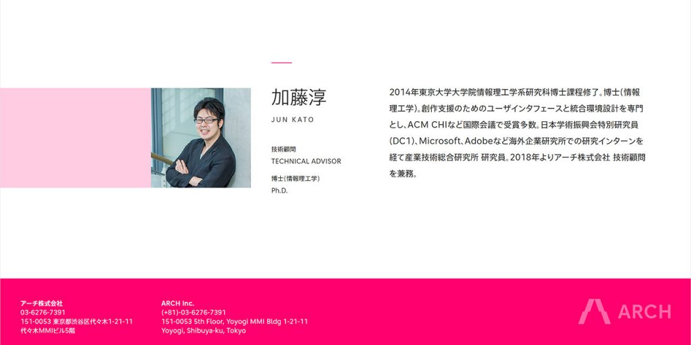

この度、アニメなどのコンテンツを幅広くプロデュースする[アーチ株式会社（ARCH Inc.）](http://archinc.jp/)の技術顧問になりました。転職ではなく、現職の産業技術総合研究所 研究員を主務としたまま、技術顧問を非常勤で兼務するかたちです。アーチから[プレスリリース](https://prtimes.jp/main/html/rd/p/000000003.000034866.html)が出ています。

研究者がアカデミアだけでなく産業界でも必要としてもらえる実例として、研究者、企業人双方の参考になるといいなと思って、技術顧問の狙いや役割、経緯などを書いてみることにしました。あとは、自分の考えの整理も兼ねています。研究者仲間には驚かれるかもしれないので（転職と勘違いされたり…）その予防措置的な意味合いもあります:)

## アニメとプログラミングの未来

アーチは、アニメなどのコンテンツ制作をプロデュースする会社です。私は、コンピュータ科学のなかでも応用寄りのHuman-Computer Interactionという分野の研究者です。統合開発環境（プログラミング環境）を構築する技術を核に、コンテンツの創作支援研究に取り組んできました。

アニメと統合開発環境は、もしかすると遠いものと思われるかもしれません。しかしながら、 ["Software is eating the world"](https://a16z.com/2016/08/20/why-software-is-eating-the-world/) の流れはアニメ業界にもやってきています。デジタル化が進み、フル3DCGの作品も当たり前になってきました。

今やアニメの制作過程ではさまざまなデジタルツールが使われており、アーティストの意図を表現できるプラグインの有無が作品のクオリティに直結します。さらに、UnityやUnreal Engineなど、従来であればゲームエンジンであり統合開発環境であったものが、作品制作の現場で利用されるようになってきています。今後、ソフトウェアの開発力がコンテンツ制作にとってますます重要になっていくことは間違いありません。

もちろん、非常勤ですし私一人で短期的に大したことはできないでしょう。ただ、アーチという会社は、それを理解したうえで私を迎えてくれています。中長期的に会社がどんな未来を目指して進んでいくのか、アニメとプログラミングの接点にいる私の存在が、それを明確にする一助になればと思っています。

## 技術顧問の役割

私の技術顧問としての役割は、これまでの創作支援研究で得てきた知見を還元し、国際的な研究コミュニティでの取り組みを共有し、今後の技術開発に際して研究者・ソフトウェアエンジニア両方の視点で助言することです。

この役割は、新しい知見を生み出す研究を行い、論文を書いて研究者コミュニティで発信する、という従来のアカデミアにおける研究者像とは少し違います。実際のところ、論文の生産性を第一に活動していたら、今回の件でお声がけいただくことはなかったかもしれません。

私は博士号取得後、論文を書くだけでなく、実際に誰かの役に立つシステムを作りたいと考えて研究開発をしてきました。研究成果である[TextAlive](https://junkato.jp/ja/textalive)や[f3.js](https://junkato.jp/ja/f3js)、そして[Songle Sync](http://tutorial.songle.jp/sync)は、いずれも[ACM CHI](http://chi2015.acm.org/)、[ACM DIS](http://dis2017.org/)、[ACM Multimedia](http://acmmm.org/2018/)といった難関国際会議に主著でフルペーパーを通すだけでなく、Webサービスとして一般公開しています。

こうした仕事は、もちろん一人でやったものではありません。研究グループには、優秀な研究者とソフトウェアエンジニアが何人もいて、この方々の協力があって今の完成度になっています。とくに、研究グループにソフトウェアエンジニアがいる環境は非常に珍しく、その目を見張る開発力を隣で観察できたことは自分にとって大変な刺激になりました。

そんな恵まれた環境にあって、前述のTextAliveとf3.jsはバックエンドからフロントエンドまで、インタプリタ実装からユーザインタフェース設計まで、自分の手で開発とデザインを行ってきました。そのおかげで、研究者としてだけでなく、[ソフトウェアエンジニアとしてもデザイナとしても](https://junkato.jp/ja/design/)それなりに知見を積み上げてくることができました。本気の本職にはかないませんが、そうした方々の気持ちが少しでも分かることが、技術顧問としては非常に重要だろうと思っています。

## 研究者+α

このように、研究者+αのスキルセットで企業とアカデミアの接着剤、緩衝材のような役割を果たす人が、今後より重宝されるはずです。また、より多くの研究者と企業に、その橋を渡すことの重要性に気づいてほしいと思っています。

詳しくは後述しますが、私とアニメ業界との関わりももう12年になります。博士課程の頃には、[少しだけ設定考証をお手伝いしたアニメ](http://gargantia.jp/)で、当時の所属だった[東京大学 五十嵐研究室](http://www-ui.is.s.u-tokyo.ac.jp/)がエンドロールにクレジットされたこともありました。そうした縁を持ち続けられたのは、幸運だったと思います。

最近ではサードプレイスやプロボノといった概念が一般に知られるようになり、「業界」「職種」の壁を越えることの重要性が認知されるようになってきました。若手研究者は、とくにそうした壁を越えることに抵抗が少ない人が多いように思います。今後、研究者+αと企業の出会いがますます増えていくことを願ってやみません。

## もうちょっと具体的な経緯

最後に、技術顧問になるまでの具体的な経緯も書き留めておきます。

アーチ株式会社のCEOである平澤さんと私とは2006年の東京大学 五月祭で出会って以来12年のお付き合いで、近年はクリエータと創作支援に関係のある研究者が年一度集まる[「名状しがたいお茶会」](https://junkato.jp/ja/teaparty/)を一緒に開催してきました。

12年の間に、私は一介の学部生からHuman-Computer Interactionの研究をする研究者になり、プログラミング環境をよりよくする博士課程以来の一連の研究を経て、人々の創造的な活動を支援するためのツールや環境作りを研究するようになりました。もともと自分が作ったものを誰かに使ってもらうのが好きだったのですが、最近とくにその傾向が強まり、["Deploy or Die"](https://alum.mit.edu/slice/deploy-or-die-media-lab-directors-new-motto) な世界観に染まってきていました。そんな折、昨年のことですが、平澤さんがこれまでの実績を引っさげてアーチ株式会社を設立されたのでした。

平澤さんと私は、根っこの部分ではもともとメタな「仕組み」に萌えを感じるところが似ていると思っています。平澤さんはこれまで、アニメ制作においてさまざまな「仕組み」を試されています。それは、製作委員会方式を超えた新しい座組みだったり、広告というかたちを借りた物語だったり、フル3DCGアニメだったり、多岐に渡ります。私は私で、プログラマが普段使っている統合開発環境を改善する研究に取り組み、 "Software is eating the world." と言われる時代を、一段メタなところから改革していこうと考えてきました。

個々のアニメ作品や個々のソフトウェアにも注力するが、それ以上に、それを産み出す仕組みを研究開発することで、テコの原理のように力強く業界に影響を与えていこうという方法論が似ているから、話がすごく合うのだと思います。そんなわけで、今後ともよろしくお願いします！

いろいろと書きましたが、私の本務は相変わらず研究です。一人前の研究者であることが全ての根っこにあります。それに少しだけ技術顧問のお仕事が加わることで、微力ながらアニメとプログラミングの未来のために貢献していければと思う所存です。同じ未来に興味のある研究者やソフトウェアエンジニアの方々、ぜひ何かの折にお声がけください。
