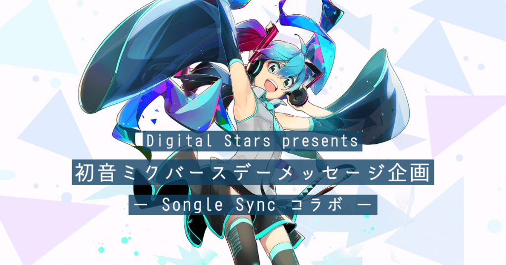

一昨年、昨年と、初音ミクの誕生日をみなさんから寄せられたメッセージとともにお祝いするイベントを支えてきました。 ACM Multimedia 2018 で発表した [Songle Sync](https://junkato.jp/ja/songle-sync/) という音楽に合わせてたくさんの端末を同期する技術が使われています。

例年はマジカルミライという幕張メッセで開催される初音ミク公式イベントとの同日開催で、会場全体をジャックするような演出をしていたのですが、今年はこれが完全オンラインイベントになり、24時間かけて6つのタイムゾーンで開催されます。詳細は以下のWebサイトに掲載されています。

Digital Stars presents 初音ミクバースデーメッセージ企画 － Songle Sync コラボ －

マジカルミライは延期になったのですが、これまで海外で7都市で開催されてきた Digital Stars というクラブイベントのオンライン版[「Digital Stars 2020 Online」](https://piapro.net/digitalstars2020/)が今、まさに開催されています。そちらでは ACM CHI 2015 で発表した [TextAlive](https://junkato.jp/ja/textalive/) というリリックビデオ制作支援サービスを活用した動画がVJで使われています。

この[BIGHEADさん](https://twitter.com/bighead11111/status/1300037724875952128)のステージでは、リリックビデオが仮想的なライブ会場の世界観に溶け込み、全体としてウィズ・コロナ時代ならではの音楽イベントが表現されています。ツールを使い倒してもらえて、とても嬉しく思っています。

https://twitter.com/bighead11111/status/1295650676391854080

https://twitter.com/bighead11111/status/1299996602950508546

産総研に入ってもう6年が経ちましたが、ゆっくり着実に社会で使われる技術を育てている実感があります。今年はこのあと、さらに楽しいイベントが予定されており、そちらも精いっぱいやっていこうと思います。
